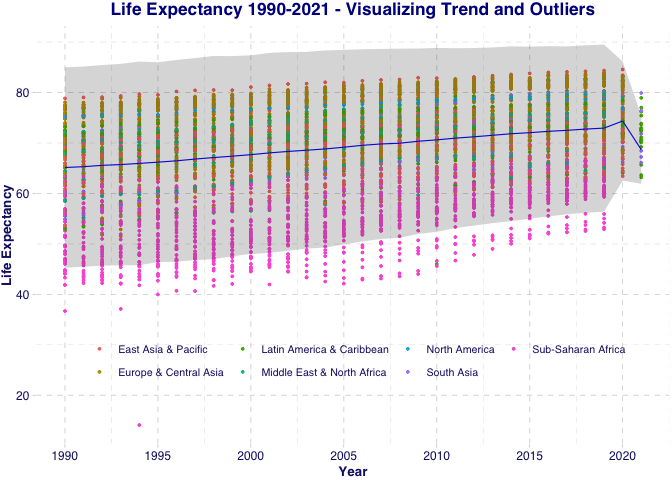
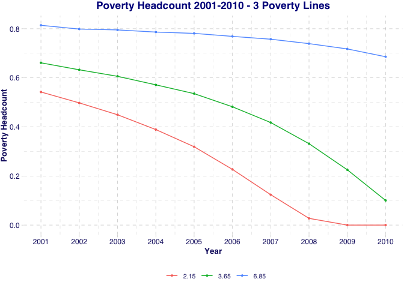
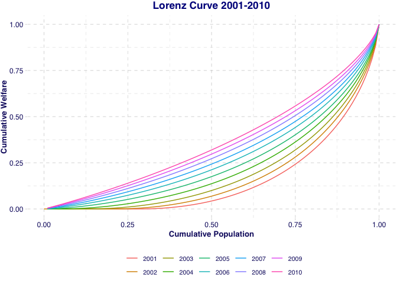
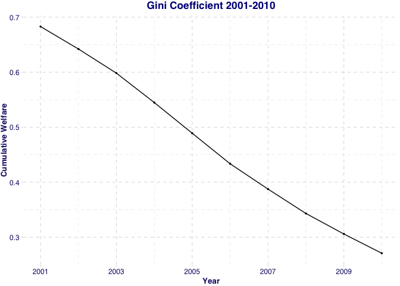

# R-Test
Marine de Franciosi
2023-11-09

# Loading packages and data

``` r
pacman::p_load(tidyverse, readr, waldo,
               skimr, data.table, matrixStats, 
               labelled, testit, ggthemes, purrr, 
               kableExtra, knitr)
```

Loading dataset as instructed:

``` r
tag      <- "202311081903"
base_url <- "https://github.com/randrescastaneda/pub_data/raw/"
data_url <- paste0(base_url, tag, "/data/Rtest1/")

wdi <- readr::read_rds(paste0(data_url, "wdi_in1.Rds"))

#install.packages("DescTools")
# first taking a glimpse at the dataset: 
dim(wdi) # number of observations and variables 
```

    [1] 5029   12

``` r
glimpse(wdi)
```

    Rows: 5,029
    Columns: 12
    $ region   <chr> "Sub-Saharan Africa", "Sub-Saharan Africa", "Sub-Saharan Afri…
    $ iso3c    <chr> "AGO", "AGO", "AGO", "AGO", "AGO", "AGO", "AGO", "AGO", "AGO"…
    $ date     <dbl> 1990, 1991, 1992, 1993, 1994, 1995, 1996, 1997, 1998, 1999, 2…
    $ country  <chr> "Angola", "Angola", "Angola", "Angola", "Angola", "Angola", "…
    $ pov_ofcl <dbl> NA, NA, NA, NA, NA, NA, NA, NA, NA, NA, NA, NA, NA, NA, NA, N…
    $ gdp      <dbl> 5793.085, 5659.119, 5158.384, 3799.195, 3728.886, 4149.446, 4…
    $ gini     <dbl> NA, NA, NA, NA, NA, NA, NA, NA, NA, NA, 52.0, NA, NA, NA, NA,…
    $ lifeex   <dbl> 41.893, 43.813, 42.209, 42.101, 43.422, 45.849, 46.033, 46.30…
    $ pop      <dbl> 11828638, 12228691, 12632507, 13038270, 13462031, 13912253, 1…
    $ pov_intl <dbl> 0.1652797, 0.1680163, 0.1919029, 0.2736178, 0.2789797, 0.2487…
    $ pov_lmic <dbl> 0.3093024, 0.3142586, 0.3537655, 0.4874785, 0.4950096, 0.4519…
    $ pov_umic <dbl> 0.5843191, 0.5963407, 0.6382768, 0.7609357, 0.7659570, 0.7248…

``` r
skimr::skim(wdi)
```

<table style="width: auto;" class="table table-condensed">
<caption>
Data summary
</caption>
<tbody>
<tr>
<td style="text-align:left;">
Name
</td>
<td style="text-align:left;">
wdi
</td>
</tr>
<tr>
<td style="text-align:left;">
Number of rows
</td>
<td style="text-align:left;">
5029
</td>
</tr>
<tr>
<td style="text-align:left;">
Number of columns
</td>
<td style="text-align:left;">
12
</td>
</tr>
<tr>
<td style="text-align:left;">
Key
</td>
<td style="text-align:left;">
iso3c, date
</td>
</tr>
<tr>
<td style="text-align:left;">
\_\_\_\_\_\_\_\_\_\_\_\_\_\_\_\_\_\_\_\_\_\_\_
</td>
<td style="text-align:left;">
</td>
</tr>
<tr>
<td style="text-align:left;">
Column type frequency:
</td>
<td style="text-align:left;">
</td>
</tr>
<tr>
<td style="text-align:left;">
character
</td>
<td style="text-align:left;">
3
</td>
</tr>
<tr>
<td style="text-align:left;">
numeric
</td>
<td style="text-align:left;">
9
</td>
</tr>
<tr>
<td style="text-align:left;">
\_\_\_\_\_\_\_\_\_\_\_\_\_\_\_\_\_\_\_\_\_\_\_\_
</td>
<td style="text-align:left;">
</td>
</tr>
<tr>
<td style="text-align:left;">
Group variables
</td>
<td style="text-align:left;">
None
</td>
</tr>
</tbody>
</table>

**Variable type: character**

<table>
<thead>
<tr>
<th style="text-align:left;">
skim_variable
</th>
<th style="text-align:right;">
n_missing
</th>
<th style="text-align:right;">
complete_rate
</th>
<th style="text-align:right;">
min
</th>
<th style="text-align:right;">
max
</th>
<th style="text-align:right;">
empty
</th>
<th style="text-align:right;">
n_unique
</th>
<th style="text-align:right;">
whitespace
</th>
</tr>
</thead>
<tbody>
<tr>
<td style="text-align:left;">
region
</td>
<td style="text-align:right;">
0
</td>
<td style="text-align:right;">
1
</td>
<td style="text-align:right;">
10
</td>
<td style="text-align:right;">
26
</td>
<td style="text-align:right;">
0
</td>
<td style="text-align:right;">
7
</td>
<td style="text-align:right;">
0
</td>
</tr>
<tr>
<td style="text-align:left;">
iso3c
</td>
<td style="text-align:right;">
0
</td>
<td style="text-align:right;">
1
</td>
<td style="text-align:right;">
3
</td>
<td style="text-align:right;">
3
</td>
<td style="text-align:right;">
0
</td>
<td style="text-align:right;">
165
</td>
<td style="text-align:right;">
0
</td>
</tr>
<tr>
<td style="text-align:left;">
country
</td>
<td style="text-align:right;">
0
</td>
<td style="text-align:right;">
1
</td>
<td style="text-align:right;">
4
</td>
<td style="text-align:right;">
24
</td>
<td style="text-align:right;">
0
</td>
<td style="text-align:right;">
165
</td>
<td style="text-align:right;">
0
</td>
</tr>
</tbody>
</table>

**Variable type: numeric**

<table>
<thead>
<tr>
<th style="text-align:left;">
skim_variable
</th>
<th style="text-align:right;">
n_missing
</th>
<th style="text-align:right;">
complete_rate
</th>
<th style="text-align:right;">
mean
</th>
<th style="text-align:right;">
sd
</th>
<th style="text-align:right;">
p0
</th>
<th style="text-align:right;">
p25
</th>
<th style="text-align:right;">
p50
</th>
<th style="text-align:right;">
p75
</th>
<th style="text-align:right;">
p100
</th>
<th style="text-align:left;">
hist
</th>
</tr>
</thead>
<tbody>
<tr>
<td style="text-align:left;">
date
</td>
<td style="text-align:right;">
0
</td>
<td style="text-align:right;">
1.00
</td>
<td style="text-align:right;">
2005.00
</td>
<td style="text-align:right;">
8.90
</td>
<td style="text-align:right;">
1990.00
</td>
<td style="text-align:right;">
1997.00
</td>
<td style="text-align:right;">
2005.00
</td>
<td style="text-align:right;">
2013.00
</td>
<td style="text-align:right;">
2.021000e+03
</td>
<td style="text-align:left;">
▇▇▇▇▇
</td>
</tr>
<tr>
<td style="text-align:left;">
pov_ofcl
</td>
<td style="text-align:right;">
4851
</td>
<td style="text-align:right;">
0.04
</td>
<td style="text-align:right;">
37.54
</td>
<td style="text-align:right;">
14.94
</td>
<td style="text-align:right;">
7.40
</td>
<td style="text-align:right;">
25.36
</td>
<td style="text-align:right;">
36.80
</td>
<td style="text-align:right;">
48.38
</td>
<td style="text-align:right;">
6.650000e+01
</td>
<td style="text-align:left;">
▃▆▇▅▅
</td>
</tr>
<tr>
<td style="text-align:left;">
gdp
</td>
<td style="text-align:right;">
217
</td>
<td style="text-align:right;">
0.96
</td>
<td style="text-align:right;">
14860.03
</td>
<td style="text-align:right;">
17242.33
</td>
<td style="text-align:right;">
436.38
</td>
<td style="text-align:right;">
3292.98
</td>
<td style="text-align:right;">
8498.03
</td>
<td style="text-align:right;">
18835.49
</td>
<td style="text-align:right;">
1.206478e+05
</td>
<td style="text-align:left;">
▇▂▁▁▁
</td>
</tr>
<tr>
<td style="text-align:left;">
gini
</td>
<td style="text-align:right;">
3225
</td>
<td style="text-align:right;">
0.36
</td>
<td style="text-align:right;">
37.79
</td>
<td style="text-align:right;">
8.83
</td>
<td style="text-align:right;">
20.70
</td>
<td style="text-align:right;">
31.17
</td>
<td style="text-align:right;">
35.70
</td>
<td style="text-align:right;">
42.92
</td>
<td style="text-align:right;">
6.580000e+01
</td>
<td style="text-align:left;">
▃▇▅▂▁
</td>
</tr>
<tr>
<td style="text-align:left;">
lifeex
</td>
<td style="text-align:right;">
0
</td>
<td style="text-align:right;">
1.00
</td>
<td style="text-align:right;">
67.92
</td>
<td style="text-align:right;">
9.51
</td>
<td style="text-align:right;">
14.10
</td>
<td style="text-align:right;">
61.89
</td>
<td style="text-align:right;">
69.85
</td>
<td style="text-align:right;">
75.00
</td>
<td style="text-align:right;">
8.456000e+01
</td>
<td style="text-align:left;">
▁▁▂▇▇
</td>
</tr>
<tr>
<td style="text-align:left;">
pop
</td>
<td style="text-align:right;">
0
</td>
<td style="text-align:right;">
1.00
</td>
<td style="text-align:right;">
39254767.21
</td>
<td style="text-align:right;">
141141150\.25
</td>
<td style="text-align:right;">
9182.00
</td>
<td style="text-align:right;">
2581242.00
</td>
<td style="text-align:right;">
8321496.00
</td>
<td style="text-align:right;">
25501941.00
</td>
<td style="text-align:right;">
1.411100e+09
</td>
<td style="text-align:left;">
▇▁▁▁▁
</td>
</tr>
<tr>
<td style="text-align:left;">
pov_intl
</td>
<td style="text-align:right;">
0
</td>
<td style="text-align:right;">
1.00
</td>
<td style="text-align:right;">
0.18
</td>
<td style="text-align:right;">
0.23
</td>
<td style="text-align:right;">
0.00
</td>
<td style="text-align:right;">
0.01
</td>
<td style="text-align:right;">
0.06
</td>
<td style="text-align:right;">
0.28
</td>
<td style="text-align:right;">
9.500000e-01
</td>
<td style="text-align:left;">
▇▂▁▁▁
</td>
</tr>
<tr>
<td style="text-align:left;">
pov_lmic
</td>
<td style="text-align:right;">
0
</td>
<td style="text-align:right;">
1.00
</td>
<td style="text-align:right;">
0.32
</td>
<td style="text-align:right;">
0.31
</td>
<td style="text-align:right;">
0.00
</td>
<td style="text-align:right;">
0.02
</td>
<td style="text-align:right;">
0.20
</td>
<td style="text-align:right;">
0.58
</td>
<td style="text-align:right;">
9.900000e-01
</td>
<td style="text-align:left;">
▇▂▂▂▂
</td>
</tr>
<tr>
<td style="text-align:left;">
pov_umic
</td>
<td style="text-align:right;">
3
</td>
<td style="text-align:right;">
1.00
</td>
<td style="text-align:right;">
0.50
</td>
<td style="text-align:right;">
0.36
</td>
<td style="text-align:right;">
0.00
</td>
<td style="text-align:right;">
0.12
</td>
<td style="text-align:right;">
0.54
</td>
<td style="text-align:right;">
0.86
</td>
<td style="text-align:right;">
1.000000e+00
</td>
<td style="text-align:left;">
▇▃▃▅▇
</td>
</tr>
</tbody>
</table>

``` r
# from a glance at the dataset, it would seem country and date uniquely identify observations
```

# Basic Stats

## 1. Replicating Summary Table of GDP per capita by region (from 1990 to 2021)

``` r
# Let's summarize the wdi dataset and display main statistics for the GDP per capita variable:
# statistics should be population-weighted as instructed: 

# using dplyr syntax: 
wdi_summ_out_repl <- wdi %>% 
 # filter(!is.na(gdp)) %>%    # removing missing GDP values
  group_by(region, date) %>% # grouping by region and year
  rename(year = date) %>%    # renaming date as year variable
  summarise(N = n(),
            Mean = stats::weighted.mean(gdp, pop, na.rm = TRUE),
            SD =  matrixStats::weightedSd(x = gdp, w = pop, na.rm = TRUE), 
            Min = min(gdp, na.rm = TRUE), 
            Max = max(gdp, na.rm = TRUE)) 
```

    `summarise()` has grouped output by 'region'. You can override using the
    `.groups` argument.

**displaying head of dataset**:

``` r
head(wdi_summ_out_repl, 50) %>% 
  kable(align = "c", format = "markdown") 
```

|        region         | year |  N  |   Mean    |    SD     |    Min    |    Max    |
|:---------------------:|:----:|:---:|:---------:|:---------:|:---------:|:---------:|
|  East Asia & Pacific  | 1990 | 22  | 4913.103  | 8496.536  | 581.6133  | 32846.39  |
|  East Asia & Pacific  | 1991 | 22  | 5105.010  | 8690.758  | 579.3788  | 33870.37  |
|  East Asia & Pacific  | 1992 | 22  | 5290.810  | 8666.693  | 597.2022  | 34048.78  |
|  East Asia & Pacific  | 1993 | 22  | 5482.790  | 8576.397  | 635.1072  | 33782.74  |
|  East Asia & Pacific  | 1994 | 22  | 5740.088  | 8619.321  | 669.3751  | 34053.52  |
|  East Asia & Pacific  | 1995 | 22  | 6037.219  | 8796.348  | 708.5049  | 34867.58  |
|  East Asia & Pacific  | 1996 | 22  | 6339.777  | 9011.027  | 746.4266  | 35878.79  |
|  East Asia & Pacific  | 1997 | 22  | 6537.701  | 9045.036  | 781.5961  | 36144.62  |
|  East Asia & Pacific  | 1998 | 22  | 6449.271  | 8823.337  | 816.5262  | 36099.02  |
|  East Asia & Pacific  | 1999 | 22  | 6634.843  | 8835.693  | 875.4185  | 37475.98  |
|  East Asia & Pacific  | 2000 | 23  | 6942.470  | 9054.579  | 973.3955  | 38494.89  |
|  East Asia & Pacific  | 2001 | 23  | 7157.720  | 9025.563  | 1083.4194 | 38779.60  |
|  East Asia & Pacific  | 2002 | 23  | 7449.350  | 9035.939  | 1198.0947 | 39872.15  |
|  East Asia & Pacific  | 2003 | 23  | 7802.672  | 9087.507  | 1340.8727 | 40642.56  |
|  East Asia & Pacific  | 2004 | 24  | 8225.192  | 9234.064  | 1511.1715 | 41905.85  |
|  East Asia & Pacific  | 2005 | 24  | 8690.507  | 9306.156  | 1702.3097 | 42704.44  |
|  East Asia & Pacific  | 2006 | 24  | 9237.262  | 9327.568  | 1914.2416 | 43286.72  |
|  East Asia & Pacific  | 2007 | 24  | 9920.135  | 9347.972  | 1973.7840 | 44109.67  |
|  East Asia & Pacific  | 2008 | 24  | 10367.217 | 9163.840  | 1895.9227 | 44777.27  |
|  East Asia & Pacific  | 2009 | 24  | 10668.371 | 8587.680  | 1874.5419 | 44684.40  |
|  East Asia & Pacific  | 2010 | 24  | 11431.945 | 8816.462  | 1819.2329 | 44965.39  |
|  East Asia & Pacific  | 2011 | 24  | 12031.219 | 8731.266  | 1819.6881 | 45405.37  |
|  East Asia & Pacific  | 2012 | 24  | 12627.012 | 8762.494  | 1883.2061 | 46360.61  |
|  East Asia & Pacific  | 2013 | 24  | 13242.288 | 8822.428  | 1932.2688 | 46744.62  |
|  East Asia & Pacific  | 2014 | 24  | 13828.938 | 8773.710  | 1883.2632 | 47240.27  |
|  East Asia & Pacific  | 2015 | 24  | 14454.771 | 8805.511  | 2038.5218 | 47567.68  |
|  East Asia & Pacific  | 2016 | 24  | 15096.085 | 8786.307  | 1997.8575 | 48109.20  |
|  East Asia & Pacific  | 2017 | 24  | 15806.715 | 8837.097  | 1970.8259 | 48400.25  |
|  East Asia & Pacific  | 2018 | 24  | 16530.946 | 8826.347  | 2039.4298 | 49052.82  |
|  East Asia & Pacific  | 2019 | 24  | 17185.302 | 8728.538  | 1963.5349 | 49379.09  |
|  East Asia & Pacific  | 2020 | 24  | 17115.830 | 8430.031  | 1897.0619 | 48747.85  |
| Europe & Central Asia | 1990 | 48  | 24285.554 | 10745.704 | 3638.8768 | 70860.82  |
| Europe & Central Asia | 1991 | 48  | 23886.687 | 11314.001 | 3496.3696 | 75961.67  |
| Europe & Central Asia | 1992 | 48  | 23171.591 | 11902.361 | 2521.4127 | 76323.30  |
| Europe & Central Asia | 1993 | 48  | 22680.486 | 12058.036 | 2085.1926 | 78468.92  |
| Europe & Central Asia | 1994 | 48  | 22383.985 | 12962.305 | 1616.6777 | 80365.22  |
| Europe & Central Asia | 1995 | 48  | 22355.489 | 13357.408 | 1389.0972 | 80379.13  |
| Europe & Central Asia | 1996 | 48  | 22630.425 | 13593.770 | 1134.2220 | 80401.03  |
| Europe & Central Asia | 1997 | 48  | 23228.872 | 13954.232 | 1137.9248 | 83702.81  |
| Europe & Central Asia | 1998 | 48  | 23679.543 | 14477.980 | 1190.6469 | 88185.80  |
| Europe & Central Asia | 1999 | 48  | 24311.996 | 14852.386 | 1228.1605 | 94115.38  |
| Europe & Central Asia | 2000 | 49  | 25431.049 | 15201.231 | 1312.7018 | 99301.53  |
| Europe & Central Asia | 2001 | 49  | 26009.219 | 15348.534 | 1407.9864 | 101143.15 |
| Europe & Central Asia | 2002 | 49  | 26498.888 | 15169.735 | 1528.3448 | 103317.33 |
| Europe & Central Asia | 2003 | 49  | 27077.313 | 14894.334 | 1663.2232 | 104743.00 |
| Europe & Central Asia | 2004 | 49  | 28046.647 | 14816.469 | 1799.8168 | 107634.84 |
| Europe & Central Asia | 2005 | 49  | 28859.935 | 14715.645 | 1884.9458 | 108632.36 |
| Europe & Central Asia | 2006 | 49  | 30063.582 | 14778.632 | 1980.2341 | 113346.04 |
| Europe & Central Asia | 2007 | 49  | 31244.859 | 14796.959 | 2095.7978 | 120647.82 |
| Europe & Central Asia | 2008 | 49  | 31562.551 | 14511.063 | 2219.3051 | 118154.67 |

comparing datasets:

``` r
# loading data to replicate for comparison: 
wdi_summ_out <- readr::read_rds(paste0(data_url, "wdi_summ_out.Rds"))

waldo::compare(wdi_summ_out, wdi_summ_out_repl)
```

    `class(old)`: "data.table"                "data.frame"
    `class(new)`: "grouped_df" "tbl_df" "tbl" "data.frame"

    `attr(old, 'groups')` is absent
    `attr(new, 'groups')` is an S3 object of class <tbl_df/tbl/data.frame>, a list

    `attr(old$region, 'label')` is absent
    `attr(new$region, 'label')` is a character vector ('region')

    `old$year` is a character vector ('1990', '1991', '1992', '1993', '1994', ...)
    `new$year` is a double vector (1990, 1991, 1992, 1993, 1994, ...)

    `old$N` is a double vector (22, 22, 22, 22, 22, ...)
    `new$N` is an integer vector (22, 22, 22, 22, 22, ...)

         old$Mean           | new$Mean                           
     [1] 4913.1033824116075 - 4913.1033824116084 [1]             
     [2] 5105.0104171493358 | 5105.0104171493358 [2]             
     [3] 5290.8095613208006 | 5290.8095613208006 [3]             
     [4] 5482.7896793386963 - 5482.7896793386972 [4]             
     [5] 5740.0878796092338 - 5740.0878796092356 [5]             
     [6] 6037.2194463295655 | 6037.2194463295655 [6]             
     [7] 6339.7772987430008 - 6339.7772987429998 [7]             
     [8] 6537.7012496267316 - 6537.7012496267325 [8]             
     [9] 6449.2714744924242 | 6449.2714744924242 [9]             
    [10] 6634.8428345702769 - 6634.8428345702760 [10]            
     ... ...                  ...                and 116 more ...

          old$Mean            | new$Mean                 
    [128] 39972.3937454740808 | 39972.3937454740808 [128]
    [129] 40540.1730477565070 | 40540.1730477565070 [129]
    [130] 41680.3363897968156 | 41680.3363897968156 [130]
    [131] 42299.3843855870655 - 42299.3843855870582 [131]
    [132] 43317.4916249835878 | 43317.4916249835878 [132]
    [133] 44705.8925252675472 | 44705.8925252675472 [133]
    [134] 46162.1959999669634 | 46162.1959999669634 [134]

          old$Mean            | new$Mean                           
    [139] 50641.6393301463177 | 50641.6393301463177 [139]          
    [140] 52075.8345827743615 | 52075.8345827743615 [140]          
    [141] 53382.2451330527474 | 53382.2451330527474 [141]          
    [142] 54332.3212907509442 - 54332.3212907509514 [142]          
    [143] 54901.6846339972544 - 54901.6846339972617 [143]          
    [144] 54483.4046545501769 | 54483.4046545501769 [144]          
    [145] 52575.3572801488699 - 52575.3572801488772 [145]          
    [146] 53554.8870340037683 - 53554.8870340037756 [146]          
    [147] 54048.0111263539293 | 54048.0111263539293 [147]          
    [148] 54833.9476994414872 | 54833.9476994414872 [148]          
      ... ...                   ...                 and 27 more ...

          old$Mean           | new$Mean                          
    [176] 3933.3196505927381 | 3933.3196505927381 [176]          
    [177] 4163.1986496962954 | 4163.1986496962954 [177]          
    [178] 4314.9787515613989 | 4314.9787515613989 [178]          
    [179] 4486.6074089603635 - 4486.6074089603626 [179]          
    [180] 4696.0101367664583 | 4696.0101367664583 [180]          
    [181] 4961.1473706195020 | 4961.1473706195020 [181]          
    [182] 5264.6321169718831 | 5264.6321169718831 [182]          
    [183] 5604.4025093391583 | 5604.4025093391583 [183]          
    [184] 5901.5029808441432 - 5901.5029808441441 [184]          
    [185] 6206.6246759065252 - 6206.6246759065261 [185]          
      ... ...                  ...                and 33 more ...

         old$SD              | new$SD                             
     [1] 8496.53633718822675 | 8496.53633718822675 [1]            
     [2] 8690.75813054334685 - 8690.75813054334503 [2]            
     [3] 8666.69255281417645 | 8666.69255281417645 [3]            
     [4] 8576.39688546040816 | 8576.39688546040816 [4]            
     [5] 8619.32053242204711 | 8619.32053242204711 [5]            
     [6] 8796.34791297051925 | 8796.34791297051925 [6]            
     [7] 9011.02696463313441 | 9011.02696463313441 [7]            
     [8] 9045.03610218434005 - 9045.03610218434187 [8]            
     [9] 8823.33658869879218 - 8823.33658869879400 [9]            
    [10] 8835.69325873518210 | 8835.69325873518210 [10]           
     ... ...                   ...                 and 16 more ...

    And 1 more differences ...

The two datasets are similar. Differences pointed out by compare()
function come down to minor differences after several decimal places.

## 2. Replicate Aggregate Stats:

``` r
# for loop for each variable? 

wdi_agg <- wdi %>% 
  group_by(region, date) %>% # grouping by region and year
  summarise(
            # Life Expectancy
            mean_lifeex = stats::weighted.mean(lifeex, pop, na.rm = TRUE),
            sd_lifeex =  matrixStats::weightedSd(x = lifeex, w = pop, na.rm = TRUE), 
            min_lifeex = min(lifeex, na.rm = TRUE), 
            max_lifeex = max(lifeex, na.rm = TRUE),
            median_lifeex = matrixStats::weightedMedian(x = lifeex, w = pop, na.rm = TRUE),
            # GDP 
            mean_gdp = stats::weighted.mean(gdp, pop, na.rm = TRUE),
            sd_gdp =  matrixStats::weightedSd(x = gdp, w = pop, na.rm = TRUE), 
            min_gdp = min(gdp, na.rm = TRUE), 
            max_gdp = max(gdp, na.rm = TRUE),
            median_gdp = matrixStats::weightedMedian(x = gdp, w = pop, na.rm = TRUE), 
            # Poverty
            mean_povintl = stats::weighted.mean(pov_intl, pop, na.rm = TRUE),
            sd_povintl =  matrixStats::weightedSd(x = pov_intl, w = pop, na.rm = TRUE), 
            min_povintl = min(pov_intl, na.rm = TRUE), 
            max_povintl = max(pov_intl, na.rm = TRUE),
            median_povintl = matrixStats::weightedMedian(x = pov_intl, w = pop, na.rm = TRUE),
            # Total Population in Each Region by Year:
            tot_pop = sum(pop, na.rm = TRUE)
            )
```

    `summarise()` has grouped output by 'region'. You can override using the
    `.groups` argument.

``` r
# Now we use pivot_longer() and pivot_wider() functions to transform the data from wide to long format: 

wdi_agg_out_repl <- wdi_agg %>% 
  
  pivot_longer(-c(region, date, tot_pop))  %>% 
  # we first gather all aggregate statistics into one "value" column with their corresponding 'name" variable taking values such as "mean_gdp" or median_lifeex". 
  
  separate(name, into = c("estimate", "variable"), sep = "_") %>% 
  # using the "_" separator, we break two the character variable "name" into two components: the estimate component (mean, sd, min, max, median) and the "variable" component corresponding to the specific variable in consideration: gdp, lifeex, povintl
  
   pivot_wider(names_from = "variable", values_from = "value")
 # finally we use pivot_wider() spreading the "variable" column into three columns: gdp, lifeex and povintl


# renaming variables and ordering dataset
wdi_agg_out_repl <- wdi_agg_out_repl %>% 
  relocate(estimate, .before = region) %>% 
  rename(pop = tot_pop, 
         pov_intl = povintl) %>% 
  mutate(estimate = factor(estimate, levels = (c("mean", "sd", "min", "max", "median")))) %>%  
  arrange(estimate)
  
# labeling variables 
labelled::var_label(wdi_agg_out_repl) <- 
  list(estimate = "estimate",
       region = "region",
       date = "year", 
       pop = "Population, total", 
       lifeex = "Life expectancy at birth, total (years)", 
       gdp = "GDP per capita, PPP (constant 2017 international $)", 
       pov_intl = "Poverty headcount at $2.15 (2017 prices)")
```

**Displaying head of dataset**:

``` r
head(wdi_agg_out_repl, 50) %>% 
  kable(align = "c", format = "markdown") %>% 
  kable_styling(bootstrap_options = c("striped", "hover"), 
                full_width = TRUE) %>%
  scroll_box(width = "600px", height = "600px")
```

    Warning in kable_styling(., bootstrap_options = c("striped", "hover"),
    full_width = TRUE): Please specify format in kable. kableExtra can customize
    either HTML or LaTeX outputs. See https://haozhu233.github.io/kableExtra/ for
    details.

| estimate |        region         | date |    pop     |  lifeex  |    gdp    | pov_intl  |
|:--------:|:---------------------:|:----:|:----------:|:--------:|:---------:|:---------:|
|   mean   |  East Asia & Pacific  | 1990 | 1754166013 | 68.19770 | 4913.103  | 0.5897045 |
|   mean   |  East Asia & Pacific  | 1991 | 1779284317 | 68.41732 | 5105.010  | 0.5731783 |
|   mean   |  East Asia & Pacific  | 1992 | 1802946756 | 68.89536 | 5290.810  | 0.5495899 |
|   mean   |  East Asia & Pacific  | 1993 | 1825777375 | 69.34064 | 5482.790  | 0.5234072 |
|   mean   |  East Asia & Pacific  | 1994 | 1848480100 | 69.62833 | 5740.088  | 0.4830632 |
|   mean   |  East Asia & Pacific  | 1995 | 1870755748 | 70.00733 | 6037.219  | 0.4504016 |
|   mean   |  East Asia & Pacific  | 1996 | 1892721009 | 70.29316 | 6339.777  | 0.4099235 |
|   mean   |  East Asia & Pacific  | 1997 | 1914534267 | 70.67039 | 6537.701  | 0.4077139 |
|   mean   |  East Asia & Pacific  | 1998 | 1935514675 | 71.06589 | 6449.271  | 0.4168976 |
|   mean   |  East Asia & Pacific  | 1999 | 1955084080 | 71.26554 | 6634.843  | 0.3861952 |
|   mean   |  East Asia & Pacific  | 2000 | 1974380842 | 71.64023 | 6942.470  | 0.3569507 |
|   mean   |  East Asia & Pacific  | 2001 | 1992025200 | 72.20763 | 7157.720  | 0.3363615 |
|   mean   |  East Asia & Pacific  | 2002 | 2008837833 | 72.54372 | 7449.350  | 0.3004620 |
|   mean   |  East Asia & Pacific  | 2003 | 2024982628 | 72.86038 | 7802.672  | 0.2707910 |
|   mean   |  East Asia & Pacific  | 2004 | 2040362927 | 72.95297 | 8225.192  | 0.2375685 |
|   mean   |  East Asia & Pacific  | 2005 | 2055565588 | 73.44410 | 8690.507  | 0.1957607 |
|   mean   |  East Asia & Pacific  | 2006 | 2070742069 | 73.79872 | 9237.262  | 0.1908682 |
|   mean   |  East Asia & Pacific  | 2007 | 2085738331 | 74.04260 | 9920.135  | 0.1701479 |
|   mean   |  East Asia & Pacific  | 2008 | 2100713254 | 74.00235 | 10367.217 | 0.1600824 |
|   mean   |  East Asia & Pacific  | 2009 | 2115342751 | 74.52669 | 10668.371 | 0.1412060 |
|   mean   |  East Asia & Pacific  | 2010 | 2129784509 | 74.72302 | 11431.945 | 0.1209233 |
|   mean   |  East Asia & Pacific  | 2011 | 2145011812 | 74.95594 | 12031.219 | 0.0943918 |
|   mean   |  East Asia & Pacific  | 2012 | 2162144561 | 75.20823 | 12627.012 | 0.0805549 |
|   mean   |  East Asia & Pacific  | 2013 | 2179061870 | 75.44920 | 13242.288 | 0.0415154 |
|   mean   |  East Asia & Pacific  | 2014 | 2195419421 | 75.70163 | 13828.938 | 0.0332039 |
|   mean   |  East Asia & Pacific  | 2015 | 2211047641 | 75.92251 | 14454.771 | 0.0252666 |
|   mean   |  East Asia & Pacific  | 2016 | 2226637138 | 76.11806 | 15096.085 | 0.0211252 |
|   mean   |  East Asia & Pacific  | 2017 | 2242494267 | 76.18488 | 15806.715 | 0.0181355 |
|   mean   |  East Asia & Pacific  | 2018 | 2256218228 | 76.57566 | 16530.946 | 0.0146757 |
|   mean   |  East Asia & Pacific  | 2019 | 2268160993 | 76.78012 | 17185.302 | 0.0111565 |
|   mean   |  East Asia & Pacific  | 2020 | 2277861231 | 76.73622 | 17115.830 | 0.0118253 |
|   mean   | Europe & Central Asia | 1990 | 839692852  | 72.22811 | 24285.554 | 0.0185888 |
|   mean   | Europe & Central Asia | 1991 | 843987268  | 72.17067 | 23886.687 | 0.0218004 |
|   mean   | Europe & Central Asia | 1992 | 847402678  | 71.89052 | 23171.591 | 0.0307886 |
|   mean   | Europe & Central Asia | 1993 | 850285670  | 71.53081 | 22680.486 | 0.0373551 |
|   mean   | Europe & Central Asia | 1994 | 852407912  | 71.70095 | 22383.985 | 0.0487208 |
|   mean   | Europe & Central Asia | 1995 | 853991333  | 71.79243 | 22355.489 | 0.0474017 |
|   mean   | Europe & Central Asia | 1996 | 855655379  | 72.22251 | 22630.425 | 0.0485134 |
|   mean   | Europe & Central Asia | 1997 | 857127065  | 72.62816 | 23228.872 | 0.0443249 |
|   mean   | Europe & Central Asia | 1998 | 858408005  | 72.94249 | 23679.543 | 0.0432629 |
|   mean   | Europe & Central Asia | 1999 | 859581049  | 72.89559 | 24311.996 | 0.0553249 |
|   mean   | Europe & Central Asia | 2000 | 862277331  | 73.13071 | 25431.049 | 0.0504540 |
|   mean   | Europe & Central Asia | 2001 | 863395400  | 73.39110 | 26009.219 | 0.0462838 |
|   mean   | Europe & Central Asia | 2002 | 864953609  | 73.50148 | 26498.888 | 0.0413026 |
|   mean   | Europe & Central Asia | 2003 | 867173880  | 73.61183 | 27077.313 | 0.0406583 |
|   mean   | Europe & Central Asia | 2004 | 869736445  | 74.05278 | 28046.647 | 0.0351221 |
|   mean   | Europe & Central Asia | 2005 | 872373068  | 74.19285 | 28859.935 | 0.0346710 |
|   mean   | Europe & Central Asia | 2006 | 875083967  | 74.69151 | 30063.582 | 0.0307062 |
|   mean   | Europe & Central Asia | 2007 | 878222275  | 75.04942 | 31244.859 | 0.0273696 |
|   mean   | Europe & Central Asia | 2008 | 881811825  | 75.31083 | 31562.551 | 0.0244849 |

**Comparing Datasets:**

``` r
# loading dataset to replication for comparison: 
wdi_agg_out <- readr::read_rds(paste0(data_url, "wdi_agg_out.Rds"))


waldo::compare(wdi_agg_out, wdi_agg_out_repl)
```

    `class(old)`: "data.table"                "data.frame"
    `class(new)`: "grouped_df" "tbl_df" "tbl" "data.frame"

    `attr(old, 'sorted')` is a character vector ('iso3c', 'date')
    `attr(new, 'sorted')` is absent

    `attr(old, 'groups')` is absent
    `attr(new, 'groups')` is an S3 object of class <tbl_df/tbl/data.frame>, a list

    `old$estimate` is a character vector ('mean', 'mean', 'mean', 'mean', 'mean', ...)
    `new$estimate` is an S3 object of class <factor>, an integer vector

         old$lifeex          | new$lifeex                         
     [1] 68.1976973388072594 - 68.1976973388072736 [1]            
     [2] 68.4173163239407671 | 68.4173163239407671 [2]            
     [3] 68.8953557627816053 - 68.8953557627815911 [3]            
     [4] 69.3406373629141655 | 69.3406373629141655 [4]            
     [5] 69.6283283110117850 - 69.6283283110117708 [5]            
     [6] 70.0073311790400794 - 70.0073311790400652 [6]            
     [7] 70.2931615690908558 | 70.2931615690908558 [7]            
     [8] 70.6703932154161976 | 70.6703932154161976 [8]            
     [9] 71.0658878891729984 - 71.0658878891730126 [9]            
    [10] 71.2655382349961712 | 71.2655382349961712 [10]           
     ... ...                   ...                 and 30 more ...

         old$lifeex          | new$lifeex                         
    [48] 74.6915096858219698 | 74.6915096858219698 [48]           
    [49] 75.0494176630977137 | 75.0494176630977137 [49]           
    [50] 75.3108306962506475 | 75.3108306962506475 [50]           
    [51] 75.6999476866083540 - 75.6999476866083398 [51]           
    [52] 75.9848478169965631 | 75.9848478169965631 [52]           
    [53] 76.4571405400979245 - 76.4571405400979103 [53]           
    [54] 76.6417777359762482 | 76.6417777359762482 [54]           
    [55] 76.9847663139150740 - 76.9847663139150455 [55]           
    [56] 77.2951182257871778 - 77.2951182257872063 [56]           
    [57] 77.2301599055240189 | 77.2301599055240189 [57]           
     ... ...                   ...                 and 70 more ...

          old$lifeex          | new$lifeex                          
    [160] 59.8072268048575211 | 59.8072268048575211 [160]           
    [161] 60.2118258351601341 | 60.2118258351601341 [161]           
    [162] 60.5611054112612592 | 60.5611054112612592 [162]           
    [163] 60.9263817466174089 - 60.9263817466173947 [163]           
    [164] 61.4488284167672489 - 61.4488284167672347 [164]           
    [165] 62.0537947207797274 | 62.0537947207797274 [165]           
    [166] 62.6663194716481442 | 62.6663194716481442 [166]           
    [167] 62.9999490050389568 | 62.9999490050389568 [167]           
    [168] 63.4081710825230473 - 63.4081710825230402 [168]           
    [169] 63.8781656847296659 - 63.8781656847296730 [169]           
      ... ...                   ...                 and 270 more ...

          old$lifeex          | new$lifeex                          
    [870] 76.5930000000000035 | 76.5930000000000035 [870]           
    [871] 75.7330000000000041 | 75.7330000000000041 [871]           
    [872] 76.0040000000000049 | 76.0040000000000049 [872]           
    [873] 68.0049999999999955 - 68.0322933204002567 [873]           
    [874] 68.1689999999999969 - 68.2041884246291090 [874]           
    [875] 68.7339999999999947 - 68.7576277045883444 [875]           
    [876] 69.2159999999999940 - 69.2407183039542389 [876]           
    [877] 69.5199999999999960 - 69.5396036446154113 [877]           
    [878] 70.0079999999999956 - 70.0212943845404965 [878]           
    [879] 70.2660000000000053 - 70.2809521770972054 [879]           
      ... ...                   ...                 and 211 more ...

         old$gdp             | new$gdp                             
     [1] 4913.10338241160844 | 4913.10338241160844 [1]             
     [2] 5105.01041714933672 - 5105.01041714933581 [2]             
     [3] 5290.80956132079882 - 5290.80956132080064 [3]             
     [4] 5482.78967933869717 | 5482.78967933869717 [4]             
     [5] 5740.08787960923655 - 5740.08787960923564 [5]             
     [6] 6037.21944632956365 - 6037.21944632956547 [6]             
     [7] 6339.77729874299894 - 6339.77729874299985 [7]             
     [8] 6537.70124962673435 - 6537.70124962673253 [8]             
     [9] 6449.27147449242420 | 6449.27147449242420 [9]             
    [10] 6634.84283457027595 | 6634.84283457027595 [10]            
     ... ...                   ...                 and 117 more ...

          old$gdp             | new$gdp                  
    [158] 1964.39372849255915 | 1964.39372849255915 [158]
    [159] 2034.78526972962072 | 2034.78526972962072 [159]
    [160] 2078.58596366213260 | 2078.58596366213260 [160]
    [161] 2156.31304223615189 - 2156.31304223615234 [161]
    [162] 2258.03651787769968 - 2258.03651787769923 [162]
    [163] 2361.42236380576242 - 2361.42236380576196 [163]
    [164] 2400.53393916362802 | 2400.53393916362802 [164]
    [165] 2482.26085567857263 | 2482.26085567857263 [165]
    [166] 2618.17371133556981 | 2618.17371133556981 [166]

    And 11 more differences ...

Minor differences due to decimal places once again.

## 3. Find Outliers:

``` r
wdi_outliers_thresholds <- wdi %>%  
  
  group_by(date) %>% 
  
  summarise(
            # Life Expectancy
            mean_lifeex = weighted.mean(x = lifeex, w = pop, na.rm = TRUE), 
            sd_lifeex = matrixStats::weightedSd(x = lifeex, w = pop, na.rm = TRUE), 
            # lower threshold below which value is an outlier
            lower_thresh_lifeex = mean_lifeex - 2.5 * sd_lifeex,
            # upper threshold above which value is an outlier 
            upper_thresh_lifeex = mean_lifeex + 2.5 * sd_lifeex, 
            
            # GDP
            mean_gdp = weighted.mean(x = gdp, w = pop, na.rm = TRUE), 
            sd_gdp = matrixStats::weightedSd(x = gdp, w = pop, na.rm = TRUE), 
            # lower threshold below which value is an outlier
            lower_thresh_gdp = mean_gdp - 2.5 * sd_gdp,
            # upper threshold above which value is an outlier 
            upper_thresh_gdp = mean_gdp + 2.5 * sd_gdp, 
            
            # Gini 
            mean_gini = weighted.mean(x = gini, w = pop, na.rm = TRUE), 
            sd_gini = matrixStats::weightedSd(x = gini, w = pop, na.rm = TRUE), 
            # lower threshold below which value is an outlier
            lower_thresh_gini = mean_gini - 2.5 * sd_gini,
            # upper threshold above which value is an outlier
            upper_thresh_gini = mean_gini + 2.5 * sd_gini
            )


# now we can merge the aggregate statistics and outlier thresholds by year with the original wdi datasets to determine which observations are outliers according to the criteria given in the exercise: 
wdi_outliers_out_repl <- merge(x = wdi, y = wdi_outliers_thresholds, by = "date")

# creating boolean variables determining whether an observation is an outlier (low or high)
wdi_outliers_out_repl <- wdi_outliers_out_repl %>% 
  
  mutate(
         # Life Expectancy 
         ll_lifeex = lifeex < lower_thresh_lifeex, 
         hl_lifeex = lifeex > upper_thresh_lifeex, 
         # GDP
         ll_gdp = gdp < lower_thresh_gdp, 
         hl_gdp = gdp > upper_thresh_gdp,
         # Gini
         ll_gini = gini < lower_thresh_gini,
         hl_gini = gini > upper_thresh_gini)


# ordering variables and observations 
wdi_outliers_out_repl <- wdi_outliers_out_repl %>% 
  relocate(ll_lifeex, .before = mean_gdp) %>% 
  relocate(hl_lifeex, .after = ll_lifeex) %>% 
  relocate(ll_gdp, .before = mean_gini) %>% 
  relocate(hl_gdp, .after = ll_gdp) %>% 
  arrange(country)
```

**Displaying head of dataset**:

``` r
head(wdi_outliers_out_repl, 50) %>% 
  kable(align = "c", format = "markdown")
```

| date |           region           | iso3c | country | pov_ofcl |    gdp    | gini | lifeex |   pop    | pov_intl  | pov_lmic  | pov_umic  | mean_lifeex | sd_lifeex | lower_thresh_lifeex | upper_thresh_lifeex | ll_lifeex | hl_lifeex | mean_gdp  |  sd_gdp  | lower_thresh_gdp | upper_thresh_gdp | ll_gdp | hl_gdp | mean_gini | sd_gini  | lower_thresh_gini | upper_thresh_gini | ll_gini | hl_gini |
|:----:|:--------------------------:|:-----:|:-------:|:--------:|:---------:|:----:|:------:|:--------:|:---------:|:---------:|:---------:|:-----------:|:---------:|:-------------------:|:-------------------:|:---------:|:---------:|:---------:|:--------:|:----------------:|:----------------:|:------:|:------:|:---------:|:--------:|:-----------------:|:-----------------:|:-------:|:-------:|
| 1990 |   Europe & Central Asia    |  ALB  | Albania |    NA    | 4827.028  |  NA  | 73.144 | 3286542  | 0.0069000 | 0.1008397 | 0.4964028 |  65.13871   | 7.941912  |      45.28393       |      84.99349       |   FALSE   |   FALSE   | 9566.977  | 12598.52 |    -21929.31     |     41063.27     | FALSE  | FALSE  | 35.80927  | 7.621505 |     16.75551      |     54.86303      |   NA    |   NA    |
| 1991 |   Europe & Central Asia    |  ALB  | Albania |    NA    | 3496.370  |  NA  | 73.378 | 3266790  | 0.0406326 | 0.2564547 | 0.7342321 |  65.30392   | 7.937230  |      45.46084       |      85.14699       |   FALSE   |   FALSE   | 9510.650  | 12531.81 |    -21818.87     |     40840.16     | FALSE  | FALSE  | 34.84978  | 6.331182 |     19.02182      |     50.67773      |   NA    |   NA    |
| 1992 |   Europe & Central Asia    |  ALB  | Albania |    NA    | 3264.821  |  NA  | 73.715 | 3247039  | 0.0522766 | 0.3131766 | 0.7745579 |  65.57109   | 7.953732  |      45.68676       |      85.45542       |   FALSE   |   FALSE   | 9492.389  | 12537.99 |    -21852.60     |     40837.37     | FALSE  | FALSE  | 41.83976  | 8.899886 |     19.59005      |     64.08948      |   NA    |   NA    |
| 1993 |   Europe & Central Asia    |  ALB  | Albania |    NA    | 3598.810  |  NA  | 73.939 | 3227287  | 0.0353470 | 0.2438462 | 0.7149127 |  65.72071   | 7.985901  |      45.75596       |      85.68546       |   FALSE   |   FALSE   | 9489.380  | 12479.77 |    -21710.05     |     40688.81     | FALSE  | FALSE  | 35.40868  | 7.161314 |     17.50540      |     53.31196      |   NA    |   NA    |
| 1994 |   Europe & Central Asia    |  ALB  | Albania |    NA    | 3921.615  |  NA  | 74.131 | 3207536  | 0.0231216 | 0.1908777 | 0.6490172 |  65.95488   | 8.075165  |      45.76697       |      86.14279       |   FALSE   |   FALSE   | 9599.831  | 12690.65 |    -22126.81     |     41326.47     | FALSE  | FALSE  | 40.98136  | 6.867103 |     23.81360      |     58.14912      |   NA    |   NA    |
| 1995 |   Europe & Central Asia    |  ALB  | Albania |    NA    | 4471.602  |  NA  | 74.362 | 3187784  | 0.0096059 | 0.1271147 | 0.5630165 |  66.20071   | 7.920361  |      46.39981       |      86.00161       |   FALSE   |   FALSE   | 9785.852  | 12838.57 |    -22310.57     |     41882.27     | FALSE  | FALSE  | 39.66104  | 9.451560 |     16.03213      |     63.28994      |   NA    |   NA    |
| 1996 |   Europe & Central Asia    |  ALB  | Albania |    NA    | 4908.932  | 27.0 | 74.592 | 3168033  | 0.0053485 | 0.0889844 | 0.4787914 |  66.46636   | 7.996269  |      46.47569       |      86.45703       |   FALSE   |   FALSE   | 10004.477 | 13046.36 |    -22611.43     |     42620.38     | FALSE  | FALSE  | 38.74123  | 8.250476 |     18.11504      |     59.36742      |  FALSE  |  FALSE  |
| 1997 |   Europe & Central Asia    |  ALB  | Albania |    NA    | 4400.313  |  NA  | 73.904 | 3148281  | 0.0204468 | 0.1808016 | 0.6268566 |  66.81484   | 8.004939  |      46.80249       |      86.82719       |   FALSE   |   FALSE   | 10242.625 | 13356.79 |    -23149.35     |     43634.60     | FALSE  | FALSE  | 41.70397  | 9.811026 |     17.17641      |     66.23154      |   NA    |   NA    |
| 1998 |   Europe & Central Asia    |  ALB  | Albania |    NA    | 4819.068  |  NA  | 74.990 | 3128530  | 0.0278254 | 0.2063644 | 0.6647328 |  67.11284   | 8.057041  |      46.97024       |      87.25544       |   FALSE   |   FALSE   | 10352.427 | 13618.77 |    -23694.50     |     44399.35     | FALSE  | FALSE  | 40.47361  | 8.946692 |     18.10688      |     62.84034      |   NA    |   NA    |
| 1999 |   Europe & Central Asia    |  ALB  | Albania |    NA    | 5474.850  |  NA  | 75.183 | 3108778  | 0.0247257 | 0.1942499 | 0.6373375 |  67.38320   | 7.934088  |      47.54798       |      87.21842       |   FALSE   |   FALSE   | 10589.516 | 13944.33 |    -24271.32     |     45450.35     | FALSE  | FALSE  | 39.38094  | 7.191094 |     21.40320      |     57.35867      |   NA    |   NA    |
| 2000 |   Europe & Central Asia    |  ALB  | Albania |    NA    | 5892.582  |  NA  | 75.404 | 3089027  | 0.0180182 | 0.1639937 | 0.5986779 |  67.68763   | 7.876091  |      47.99740       |      87.37785       |   FALSE   |   FALSE   | 10940.954 | 14371.81 |    -24988.58     |     46870.49     | FALSE  | FALSE  | 39.14598  | 8.497427 |     17.90241      |     60.38955      |   NA    |   NA    |
| 2001 |   Europe & Central Asia    |  ALB  | Albania |    NA    | 6441.441  |  NA  | 75.639 | 3060173  | 0.0146913 | 0.1438653 | 0.5652597 |  68.03955   | 7.926232  |      48.22397       |      87.85513       |   FALSE   |   FALSE   | 11065.131 | 14400.14 |    -24935.22     |     47065.48     | FALSE  | FALSE  | 39.28925  | 9.928771 |     14.46732      |     64.11117      |   NA    |   NA    |
| 2002 |   Europe & Central Asia    |  ALB  | Albania |    NA    | 6753.881  | 31.7 | 75.890 | 3051010  | 0.0109265 | 0.1138832 | 0.5209097 |  68.32245   | 7.876650  |      48.63082       |      88.01407       |   FALSE   |   FALSE   | 11239.108 | 14433.26 |    -24844.04     |     47322.26     | FALSE  | FALSE  | 41.25667  | 6.857553 |     24.11279      |     58.40055      |  FALSE  |  FALSE  |
| 2003 |   Europe & Central Asia    |  ALB  | Albania |    NA    | 7153.995  |  NA  | 76.142 | 3039616  | 0.0081524 | 0.0917289 | 0.4698318 |  68.56633   | 7.798309  |      49.07056       |      88.06211       |   FALSE   |   FALSE   | 11490.301 | 14558.40 |    -24905.71     |     47886.31     | FALSE  | FALSE  | 40.20792  | 8.461240 |     19.05482      |     61.36102      |   NA    |   NA    |
| 2004 |   Europe & Central Asia    |  ALB  | Albania |    NA    | 7580.128  |  NA  | 76.376 | 3026939  | 0.0076319 | 0.0835264 | 0.4443899 |  68.81916   | 7.813363  |      49.28575       |      88.35257       |   FALSE   |   FALSE   | 11906.504 | 14858.01 |    -25238.52     |     49051.53     | FALSE  | FALSE  | 37.36054  | 7.184098 |     19.40029      |     55.32079      |   NA    |   NA    |
| 2005 |   Europe & Central Asia    |  ALB  | Albania |    NA    | 8040.081  | 30.6 | 76.621 | 3011487  | 0.0059109 | 0.0728930 | 0.4042843 |  69.16151   | 7.714661  |      49.87485       |      88.44816       |   FALSE   |   FALSE   | 12280.878 | 15077.46 |    -25412.77     |     49974.52     | FALSE  | FALSE  | 40.36008  | 7.201896 |     22.35534      |     58.36482      |  FALSE  |  FALSE  |
| 2006 |   Europe & Central Asia    |  ALB  | Albania |    NA    | 8568.550  |  NA  | 76.816 | 2992547  | 0.0039996 | 0.0658647 | 0.3901018 |  69.53963   | 7.617820  |      50.49508       |      88.58418       |   FALSE   |   FALSE   | 12744.601 | 15319.27 |    -25553.57     |     51042.78     | FALSE  | FALSE  | 40.11037  | 7.770399 |     20.68437      |     59.53637      |   NA    |   NA    |
| 2007 |   Europe & Central Asia    |  ALB  | Albania |    NA    | 9150.117  |  NA  | 77.549 | 2970017  | 0.0028749 | 0.0512457 | 0.3613156 |  69.80928   | 7.534696  |      50.97254       |      88.64602       |   FALSE   |   FALSE   | 13231.451 | 15460.12 |    -25418.84     |     51881.75     | FALSE  | FALSE  | 38.29966  | 7.630524 |     19.22335      |     57.37597      |   NA    |   NA    |
| 2008 |   Europe & Central Asia    |  ALB  | Albania |    NA    | 9912.148  | 30.0 | 77.653 | 2947314  | 0.0019993 | 0.0390261 | 0.3343185 |  69.95129   | 7.496866  |      51.20912       |      88.69345       |   FALSE   |   FALSE   | 13419.788 | 15289.32 |    -24803.52     |     51643.10     | FALSE  | FALSE  | 40.81463  | 6.784719 |     23.85283      |     57.77643      |  FALSE  |  FALSE  |
| 2009 |   Europe & Central Asia    |  ALB  | Albania |    NA    | 10313.902 |  NA  | 77.781 | 2927519  | 0.0034688 | 0.0408429 | 0.3438401 |  70.34661   | 7.351659  |      51.96746       |      88.72576       |   FALSE   |   FALSE   | 13174.357 | 14455.90 |    -22965.41     |     49314.12     | FALSE  | FALSE  | 37.95138  | 6.171712 |     22.52210      |     53.38066      |   NA    |   NA    |
| 2010 |   Europe & Central Asia    |  ALB  | Albania |    NA    | 10749.466 |  NA  | 77.936 | 2913021  | 0.0045130 | 0.0395439 | 0.3455992 |  70.62082   | 7.289478  |      52.39713       |      88.84452       |   FALSE   |   FALSE   | 13660.794 | 14671.11 |    -23016.98     |     50338.57     | FALSE  | FALSE  | 38.84934  | 6.549801 |     22.47484      |     55.22384      |   NA    |   NA    |
| 2011 |   Europe & Central Asia    |  ALB  | Albania |    NA    | 11052.778 |  NA  | 78.092 | 2905195  | 0.0051550 | 0.0425226 | 0.3492214 |  70.95878   | 7.129749  |      53.13440       |      88.78315       |   FALSE   |   FALSE   | 14021.017 | 14787.15 |    -22946.86     |     50988.89     | FALSE  | FALSE  | 38.78036  | 5.617123 |     24.73755      |     52.82317      |   NA    |   NA    |
| 2012 |   Europe & Central Asia    |  ALB  | Albania |    NA    | 11227.950 | 29.0 | 78.064 | 2900401  | 0.0062069 | 0.0480544 | 0.3666775 |  71.22893   | 7.038891  |      53.63170       |      88.82616       |   FALSE   |   FALSE   | 14284.920 | 14818.21 |    -22760.60     |     51330.44     | FALSE  | FALSE  | 40.21631  | 5.962506 |     25.31005      |     55.12258      |  FALSE  |  FALSE  |
| 2013 |   Europe & Central Asia    |  ALB  | Albania |    NA    | 11361.252 |  NA  | 78.123 | 2895092  | 0.0092673 | 0.0771574 | 0.3776502 |  71.52264   | 6.965711  |      54.10837       |      88.93692       |   FALSE   |   FALSE   | 14572.444 | 14850.15 |    -22552.94     |     51697.82     | FALSE  | FALSE  | 38.77854  | 5.663425 |     24.61998      |     52.93711      |   NA    |   NA    |
| 2014 |   Europe & Central Asia    |  ALB  | Albania |    NA    | 11586.817 | 34.6 | 78.407 | 2889104  | 0.0102310 | 0.0967597 | 0.3874383 |  71.83224   | 6.927617  |      54.51320       |      89.15128       |   FALSE   |   FALSE   | 14895.884 | 14966.62 |    -22520.67     |     52312.44     | FALSE  | FALSE  | 39.66306  | 6.260616 |     24.01152      |     55.31460      |  FALSE  |  FALSE  |
| 2015 |   Europe & Central Asia    |  ALB  | Albania |    NA    | 11878.438 | 32.8 | 78.644 | 2880703  | 0.0012062 | 0.0369900 | 0.2615431 |  72.04576   | 6.819779  |      54.99631       |      89.09520       |   FALSE   |   FALSE   | 15220.731 | 15157.66 |    -22673.43     |     53114.89     | FALSE  | FALSE  | 37.56216  | 4.923590 |     25.25318      |     49.87113      |  FALSE  |  FALSE  |
| 2016 |   Europe & Central Asia    |  ALB  | Albania |    NA    | 12291.842 | 33.7 | 78.860 | 2876101  | 0.0013930 | 0.0466664 | 0.2541383 |  72.30952   | 6.753262  |      55.42636       |      89.19267       |   FALSE   |   FALSE   | 15550.686 | 15250.47 |    -22575.49     |     53676.86     | FALSE  | FALSE  | 37.71794  | 5.119278 |     24.91975      |     50.51614      |  FALSE  |  FALSE  |
| 2017 |   Europe & Central Asia    |  ALB  | Albania |    NA    | 12770.992 | 33.1 | 79.047 | 2873457  | 0.0039257 | 0.0362668 | 0.2554100 |  72.50898   | 6.649733  |      55.88465       |      89.13332       |   FALSE   |   FALSE   | 15965.417 | 15476.97 |    -22727.02     |     54657.85     | FALSE  | FALSE  | 37.92075  | 4.860761 |     25.76885      |     50.07265      |  FALSE  |  FALSE  |
| 2018 |   Europe & Central Asia    |  ALB  | Albania |    NA    | 13317.119 | 30.1 | 79.184 | 2866376  | 0.0004811 | 0.0273037 | 0.1816096 |  72.75578   | 6.643446  |      56.14716       |      89.36439       |   FALSE   |   FALSE   | 16379.375 | 15713.16 |    -22903.53     |     55662.28     | FALSE  | FALSE  | 37.56201  | 5.213651 |     24.52789      |     50.59614      |  FALSE  |  FALSE  |
| 2019 |   Europe & Central Asia    |  ALB  | Albania |    NA    | 13653.182 | 30.1 | 79.282 | 2854191  | 0.0000000 | 0.0115013 | 0.1490186 |  72.95224   | 6.623025  |      56.39468       |      89.50980       |   FALSE   |   FALSE   | 16689.970 | 15891.68 |    -23039.23     |     56419.17     | FALSE  | FALSE  | 37.57519  | 5.062162 |     24.91978      |     50.23059      |  FALSE  |  FALSE  |
| 2020 |   Europe & Central Asia    |  ALB  | Albania |    NA    | 13278.370 | 29.4 | 76.989 | 2837849  | 0.0002128 | 0.0147796 | 0.1367199 |  74.35534   | 4.717182  |      62.56238       |      86.14829       |   FALSE   |   FALSE   | 18637.652 | 15789.62 |    -20836.40     |     58111.70     | FALSE  | FALSE  | 37.08401  | 4.392626 |     26.10245      |     48.06558      |  FALSE  |  FALSE  |
| 1990 | Middle East & North Africa |  DZA  | Algeria |    NA    | 8828.874  |  NA  | 67.416 | 25518074 | 0.0517968 | 0.2237311 | 0.5936019 |  65.13871   | 7.941912  |      45.28393       |      84.99349       |   FALSE   |   FALSE   | 9566.977  | 12598.52 |    -21929.31     |     41063.27     | FALSE  | FALSE  | 35.80927  | 7.621505 |     16.75551      |     54.86303      |   NA    |   NA    |
| 1991 | Middle East & North Africa |  DZA  | Algeria |    NA    | 8517.377  |  NA  | 67.688 | 26133905 | 0.0641722 | 0.2529208 | 0.6316003 |  65.30392   | 7.937230  |      45.46084       |      85.14699       |   FALSE   |   FALSE   | 9510.650  | 12531.81 |    -21818.87     |     40840.16     | FALSE  | FALSE  | 34.84978  | 6.331182 |     19.02182      |     50.67773      |   NA    |   NA    |
| 1992 | Middle East & North Africa |  DZA  | Algeria |    NA    | 8471.528  |  NA  | 67.757 | 26748303 | 0.0597211 | 0.2440524 | 0.6182341 |  65.57109   | 7.953732  |      45.68676       |      85.45542       |   FALSE   |   FALSE   | 9492.389  | 12537.99 |    -21852.60     |     40837.37     | FALSE  | FALSE  | 41.83976  | 8.899886 |     19.59005      |     64.08948      |   NA    |   NA    |
| 1993 | Middle East & North Africa |  DZA  | Algeria |    NA    | 8109.884  |  NA  | 67.719 | 27354327 | 0.0610516 | 0.2476665 | 0.6211920 |  65.72071   | 7.985901  |      45.75596       |      85.68546       |   FALSE   |   FALSE   | 9489.380  | 12479.77 |    -21710.05     |     40688.81     | FALSE  | FALSE  | 35.40868  | 7.161314 |     17.50540      |     53.31196      |   NA    |   NA    |
| 1994 | Middle East & North Africa |  DZA  | Algeria |    NA    | 7869.270  |  NA  | 67.361 | 27937006 | 0.0639814 | 0.2544147 | 0.6265836 |  65.95488   | 8.075165  |      45.76697       |      86.14279       |   FALSE   |   FALSE   | 9599.831  | 12690.65 |    -22126.81     |     41326.47     | FALSE  | FALSE  | 40.98136  | 6.867103 |     23.81360      |     58.14912      |   NA    |   NA    |
| 1995 | Middle East & North Africa |  DZA  | Algeria |    NA    | 8013.123  | 35.3 | 67.454 | 28478022 | 0.0577057 | 0.2424832 | 0.6110342 |  66.20071   | 7.920361  |      46.39981       |      86.00161       |   FALSE   |   FALSE   | 9785.852  | 12838.57 |    -22310.57     |     41882.27     | FALSE  | FALSE  | 39.66104  | 9.451560 |     16.03213      |     63.28994      |  FALSE  |  FALSE  |
| 1996 | Middle East & North Africa |  DZA  | Algeria |    NA    | 8195.860  |  NA  | 68.749 | 28984634 | 0.0640979 | 0.2583526 | 0.6396594 |  66.46636   | 7.996269  |      46.47569       |      86.45703       |   FALSE   |   FALSE   | 10004.477 | 13046.36 |    -22611.43     |     42620.38     | FALSE  | FALSE  | 38.74123  | 8.250476 |     18.11504      |     59.36742      |   NA    |   NA    |
| 1997 | Middle East & North Africa |  DZA  | Algeria |    NA    | 8147.878  |  NA  | 69.171 | 29476031 | 0.0700399 | 0.2738193 | 0.6670192 |  66.81484   | 8.004939  |      46.80249       |      86.82719       |   FALSE   |   FALSE   | 10242.625 | 13356.79 |    -23149.35     |     43634.60     | FALSE  | FALSE  | 41.70397  | 9.811026 |     17.17641      |     66.23154      |   NA    |   NA    |
| 1998 | Middle East & North Africa |  DZA  | Algeria |    NA    | 8435.036  |  NA  | 69.451 | 29924668 | 0.0655035 | 0.2664069 | 0.6670157 |  67.11284   | 8.057041  |      46.97024       |      87.25544       |   FALSE   |   FALSE   | 10352.427 | 13618.77 |    -23694.50     |     44399.35     | FALSE  | FALSE  | 40.47361  | 8.946692 |     18.10688      |     62.84034      |   NA    |   NA    |
| 1999 | Middle East & North Africa |  DZA  | Algeria |    NA    | 8584.071  |  NA  | 70.032 | 30346083 | 0.0591778 | 0.2538724 | 0.6595860 |  67.38320   | 7.934088  |      47.54798       |      87.21842       |   FALSE   |   FALSE   | 10589.516 | 13944.33 |    -24271.32     |     45450.35     | FALSE  | FALSE  | 39.38094  | 7.191094 |     21.40320      |     57.35867      |   NA    |   NA    |
| 2000 | Middle East & North Africa |  DZA  | Algeria |    NA    | 8786.190  |  NA  | 70.478 | 30774621 | 0.0497705 | 0.2315517 | 0.6406370 |  67.68763   | 7.876091  |      47.99740       |      87.37785       |   FALSE   |   FALSE   | 10940.954 | 14371.81 |    -24988.58     |     46870.49     | FALSE  | FALSE  | 39.14598  | 8.497427 |     17.90241      |     60.38955      |   NA    |   NA    |
| 2001 | Middle East & North Africa |  DZA  | Algeria |    NA    | 8926.110  |  NA  | 70.823 | 31200985 | 0.0452364 | 0.2217048 | 0.6365480 |  68.03955   | 7.926232  |      48.22397       |      87.85513       |   FALSE   |   FALSE   | 11065.131 | 14400.14 |    -24935.22     |     47065.48     | FALSE  | FALSE  | 39.28925  | 9.928771 |     14.46732      |     64.11117      |   NA    |   NA    |
| 2002 | Middle East & North Africa |  DZA  | Algeria |    NA    | 9299.682  |  NA  | 71.230 | 31624696 | 0.0369304 | 0.1871504 | 0.5942148 |  68.32245   | 7.876650  |      48.63082       |      88.01407       |   FALSE   |   FALSE   | 11239.108 | 14433.26 |    -24844.04     |     47322.26     | FALSE  | FALSE  | 41.25667  | 6.857553 |     24.11279      |     58.40055      |   NA    |   NA    |
| 2003 | Middle East & North Africa |  DZA  | Algeria |    NA    | 9835.162  |  NA  | 71.287 | 32055883 | 0.0314687 | 0.1698188 | 0.5764566 |  68.56633   | 7.798309  |      49.07056       |      88.06211       |   FALSE   |   FALSE   | 11490.301 | 14558.40 |    -24905.71     |     47886.31     | FALSE  | FALSE  | 40.20792  | 8.461240 |     19.05482      |     61.36102      |   NA    |   NA    |
| 2004 | Middle East & North Africa |  DZA  | Algeria |    NA    | 10114.726 |  NA  | 71.762 | 32510186 | 0.0251839 | 0.1473159 | 0.5480747 |  68.81916   | 7.813363  |      49.28575       |      88.35257       |   FALSE   |   FALSE   | 11906.504 | 14858.01 |    -25238.52     |     49051.53     | FALSE  | FALSE  | 37.36054  | 7.184098 |     19.40029      |     55.32079      |   NA    |   NA    |
| 2005 | Middle East & North Africa |  DZA  | Algeria |    NA    | 10566.373 |  NA  | 72.061 | 32956690 | 0.0210105 | 0.1309001 | 0.5279457 |  69.16151   | 7.714661  |      49.87485       |      88.44816       |   FALSE   |   FALSE   | 12280.878 | 15077.46 |    -25412.77     |     49974.52     | FALSE  | FALSE  | 40.36008  | 7.201896 |     22.35534      |     58.36482      |   NA    |   NA    |
| 2006 | Middle East & North Africa |  DZA  | Algeria |    NA    | 10592.247 |  NA  | 72.334 | 33435080 | 0.0179835 | 0.1188781 | 0.5149538 |  69.53963   | 7.617820  |      50.49508       |      88.58418       |   FALSE   |   FALSE   | 12744.601 | 15319.27 |    -25553.57     |     51042.78     | FALSE  | FALSE  | 40.11037  | 7.770399 |     20.68437      |     59.53637      |   NA    |   NA    |
| 2007 | Middle East & North Africa |  DZA  | Algeria |    NA    | 10775.532 |  NA  | 72.602 | 33983827 | 0.0144314 | 0.1020670 | 0.4905065 |  69.80928   | 7.534696  |      50.97254       |      88.64602       |   FALSE   |   FALSE   | 13231.451 | 15460.12 |    -25418.84     |     51881.75     | FALSE  | FALSE  | 38.29966  | 7.630524 |     19.22335      |     57.37597      |   NA    |   NA    |
| 2008 | Middle East & North Africa |  DZA  | Algeria |    NA    | 10847.177 |  NA  | 72.941 | 34569592 | 0.0110151 | 0.0832022 | 0.4568717 |  69.95129   | 7.496866  |      51.20912       |      88.69345       |   FALSE   |   FALSE   | 13419.788 | 15289.32 |    -24803.52     |     51643.10     | FALSE  | FALSE  | 40.81463  | 6.784719 |     23.85283      |     57.77643      |   NA    |   NA    |

Comparison with data to replicate:

``` r
# data to replicate 
wdi_outliers_out <- readr::read_rds(paste0(data_url, "wdi_outliers_out.Rds"))

# arrranging by country for comparison purposes:
wdi_outliers_out <- wdi_outliers_out %>% 
  arrange(country)

# asserting outlier detection is the same in both datasets: 
# if not, then an error message will appear

# for Life Expectancy
message_l <- "Lower outlier detection for life expectancy is not the same in both datasets"
message_h <- "Higher outlier detection for life expectancy is not the same in both datasets"

testit::assert(message_l, 
               sum(wdi_outliers_out_repl$ll_lifeex != wdi_outliers_out$ll_lifeex, na.rm = TRUE) == 0) 

testit::assert(message_h, 
               sum(wdi_outliers_out_repl$hl_lifeex != wdi_outliers_out$hl_lifeex, na.rm = TRUE) == 0) 

# For GDP
testit::assert(message_l, 
               sum(wdi_outliers_out_repl$ll_gdp != wdi_outliers_out$ll_gdp, na.rm = TRUE) == 0) 

testit::assert(message_h, 
               sum(wdi_outliers_out_repl$hl_gdp != wdi_outliers_out$hl_gdp, na.rm = TRUE) == 0) 

# For Gini coefficient: 
testit::assert(message_l, 
               sum(wdi_outliers_out_repl$ll_gini != wdi_outliers_out$ll_gini, na.rm = TRUE) == 0) 

testit::assert(message_h, 
               sum(wdi_outliers_out_repl$hl_gini != wdi_outliers_out$hl_gini, na.rm = TRUE) == 0) 
```

Replicating outlier figure using ggplot package:

``` r
ggplot(
      # dataset and x and y variables for line representing weighted mean life expectancy
      wdi_outliers_out_repl, aes(x = date, y = mean_lifeex)) + 
      # titles and aesthetics
      ggtitle("Life Expectancy 1990-2021 - Visualizing Trend and Outliers") +
      theme_pander() +
      scale_x_continuous(name = "Year", breaks = seq(1990, 2021, 5)) +
      scale_y_continuous(name = "Life Expectancy", breaks = seq(20, 80, 20)) +

      # adding data points colored by region
      geom_point(data = wdi_outliers_out_repl,
                 aes(x  = date, y = lifeex, color = factor(region)), 
                 size = 0.6) +
      # adding line representing the population-weighted mean over the years
      geom_line(linewidth = 0.4, color = "blue") + 
      # adding 2.5sd confidence interval
      geom_ribbon(aes(ymin = lower_thresh_lifeex, ymax = upper_thresh_lifeex),
                  alpha = 0.2) +
      
  # formatting title, axis titles and legend
   theme(plot.title = element_text(color = "dark blue", size = 13, face = "bold", hjust = 0.5),
         axis.title.x = element_text(color = "midnightblue", size = 10, face = "bold", hjust = 0.5), 
         axis.title.y = element_text(color = "midnightblue", size = 10, face = "bold", vjust = 0.5), 
         axis.text.x = element_text(color = "midnightblue", size = 9), 
         axis.text.y = element_text(color = "midnightblue", size = 9), 
         legend.position = c(0.5, 0.2), 
         legend.direction = "horizontal",
         legend.background=element_blank(),
         legend.title = element_blank(),
         legend.text = element_text(color = "midnightblue", size = 8))
```



# Simulated Data

## 4. Poverty Measures:

Loading data as instructed

``` r
l_svy <-readr::read_rds(paste0(data_url, "svy_sim_in1.Rds"))

glimpse(l_svy)
```

    List of 10
     $ Y2001:Classes 'data.table' and 'data.frame': 100000 obs. of  3 variables:
      ..$ income: num [1:100000] 0 0 0 0 0 0 0 0 0 0 ...
      ..$ weight: int [1:100000] 1 1 1 1 1 1 1 1 1 1 ...
      ..$ area  : Factor w/ 2 levels "urban","rural": 1 2 1 1 1 1 1 1 1 1 ...
      ..- attr(*, ".internal.selfref")=<externalptr> 
     $ Y2002:Classes 'data.table' and 'data.frame': 100000 obs. of  3 variables:
      ..$ income: num [1:100000] 0 0 0 0 0 0 0 0 0 0 ...
      ..$ weight: int [1:100000] 1 1 1 1 1 1 1 1 1 1 ...
      ..$ area  : Factor w/ 2 levels "urban","rural": 1 2 1 1 1 1 1 1 2 1 ...
      ..- attr(*, ".internal.selfref")=<externalptr> 
     $ Y2003:Classes 'data.table' and 'data.frame': 100000 obs. of  3 variables:
      ..$ income: num [1:100000] 0 0 0 0 0 0 0 0 0 0 ...
      ..$ weight: int [1:100000] 1 1 1 1 1 1 1 1 1 1 ...
      ..$ area  : Factor w/ 2 levels "urban","rural": 2 1 1 1 1 1 2 1 1 1 ...
      ..- attr(*, ".internal.selfref")=<externalptr> 
     $ Y2004:Classes 'data.table' and 'data.frame': 100000 obs. of  3 variables:
      ..$ income: num [1:100000] 0 0 0 0 0 0 0 0 0 0 ...
      ..$ weight: int [1:100000] 1 1 1 1 1 1 1 1 1 1 ...
      ..$ area  : Factor w/ 2 levels "urban","rural": 1 2 1 1 2 1 2 2 2 2 ...
      ..- attr(*, ".internal.selfref")=<externalptr> 
     $ Y2005:Classes 'data.table' and 'data.frame': 100000 obs. of  3 variables:
      ..$ income: num [1:100000] 0 0 0 0 0 0 0 0 0 0 ...
      ..$ weight: int [1:100000] 1 1 1 1 1 1 1 1 1 1 ...
      ..$ area  : Factor w/ 2 levels "urban","rural": 1 1 1 1 1 1 2 1 1 1 ...
      ..- attr(*, ".internal.selfref")=<externalptr> 
     $ Y2006:Classes 'data.table' and 'data.frame': 100000 obs. of  3 variables:
      ..$ income: num [1:100000] 0.294 0.302 0.307 0.307 0.308 ...
      ..$ weight: int [1:100000] 1 1 1 1 1 1 1 1 1 1 ...
      ..$ area  : Factor w/ 2 levels "urban","rural": 1 2 1 2 1 1 1 1 1 1 ...
      ..- attr(*, ".internal.selfref")=<externalptr> 
     $ Y2007:Classes 'data.table' and 'data.frame': 100000 obs. of  3 variables:
      ..$ income: num [1:100000] 0.911 0.912 0.913 0.913 0.914 ...
      ..$ weight: int [1:100000] 1 1 1 1 1 1 1 1 1 1 ...
      ..$ area  : Factor w/ 2 levels "urban","rural": 1 1 2 1 1 1 1 1 2 1 ...
      ..- attr(*, ".internal.selfref")=<externalptr> 
     $ Y2008:Classes 'data.table' and 'data.frame': 100000 obs. of  3 variables:
      ..$ income: num [1:100000] 1.52 1.52 1.52 1.52 1.52 ...
      ..$ weight: int [1:100000] 1 1 1 1 1 1 1 1 1 1 ...
      ..$ area  : Factor w/ 2 levels "urban","rural": 2 1 1 1 1 2 1 1 1 1 ...
      ..- attr(*, ".internal.selfref")=<externalptr> 
     $ Y2009:Classes 'data.table' and 'data.frame': 100000 obs. of  3 variables:
      ..$ income: num [1:100000] 2.14 2.14 2.14 2.14 2.14 ...
      ..$ weight: int [1:100000] 1 1 1 1 1 1 1 1 1 1 ...
      ..$ area  : Factor w/ 2 levels "urban","rural": 1 2 2 1 1 1 1 1 2 1 ...
      ..- attr(*, ".internal.selfref")=<externalptr> 
     $ Y2010:Classes 'data.table' and 'data.frame': 100000 obs. of  3 variables:
      ..$ income: num [1:100000] 2.72 2.72 2.72 2.72 2.72 ...
      ..$ weight: int [1:100000] 1 1 1 1 1 1 1 1 1 1 ...
      ..$ area  : Factor w/ 2 levels "urban","rural": 1 1 2 1 1 1 2 2 1 1 ...
      ..- attr(*, ".internal.selfref")=<externalptr> 

``` r
# this R object is a list with each element corresponding to a simulated household dataset for each year from 2001 to 2010
# each dataset contains the same variables
```

:

``` r
# Let's bind all the dataframe elements of the list into one dataframe using the bind_rows() function from dplyr: 
l_svy_df <- bind_rows(l_svy, .id = "year")

# cleaning up year variable: 
l_svy_df$year <- gsub('Y','', l_svy_df$year) 
l_svy_df$year <- as.numeric(l_svy_df$year)


# calculating povery headcount, by year and for each poverty line: 
pov_out <- l_svy_df %>% 
  
  group_by(year) %>% 
  
  mutate(
        # defining poverty dummy according to poverty lines
         poor215  = income < 2.15, 
         poor365 = income < 3.65, 
         poor685 = income < 6.85, 
         
         # poverty headcount:
         headcount_215 = sum(poor215 * weight) / sum(weight), 
         headcount_365 = sum(poor365 * weight) / sum(weight), 
         headcount_685 = sum(poor685 * weight) / sum(weight), 
         
         # poverty gap: 
           # first calculating "gap" part of the eqution
         gap215 = ((2.15-income) * poor215) / 2.15,
         gap365 = ((3.65-income) * poor365) / 3.65,
         gap685 = ((6.85-income) * poor685) / 6.85,
           # aggregating with weights: 
         povgap_215 = sum(gap215 * weight) / sum(weight), 
         povgap_365 = sum(gap365 * weight) / sum(weight),
         povgap_685 = sum(gap685 * weight) / sum(weight),
         
         # poverty severity: similar formula as poverty gap with gap^2 
         povseverity_215 = sum(gap215^2 * weight)/sum(weight), 
         povseverity_365 = sum(gap365^2 * weight)/sum(weight),
         povseverity_685 = sum(gap685^2 * weight)/sum(weight)
         ) %>%  
  
  # keeping variables of interest only
  select(year, headcount_215, headcount_365, headcount_685, 
         povgap_215, povgap_365, povgap_685, povseverity_215, 
         povseverity_365, povseverity_685) %>%  
  
  # removing duplicates: 
  distinct()

# now transforming dataset from wide to long: 
pov_out_repl <- pov_out %>% 
      # first gather aggregate statistic into one "value" column 
      pivot_longer(-year) %>% 
      # separating name variable to facilitate pivot_wider() operation below
      separate(name, into = c("measure", "pov_line"), sep = "_") %>% 
      # reshaping from long to wide for desired dataset format
      pivot_wider(names_from = "measure", values_from = "value") %>% 
      # cleaning pov_line variable
      mutate(pov_line = as.numeric(pov_line)/100)
```

**Displaying dataset**:

``` r
pov_out_repl %>% 
  kable(align = "c", format = "markdown")
```

| year | pov_line | headcount |  povgap   | povseverity |
|:----:|:--------:|:---------:|:---------:|:-----------:|
| 2001 |   2.15   | 0.5422254 | 0.4228365 |  0.3798612  |
| 2001 |   3.65   | 0.6611328 | 0.4975328 |  0.4352643  |
| 2001 |   6.85   | 0.8138747 | 0.6139778 |  0.5287430  |
| 2002 |   2.15   | 0.4978546 | 0.3613057 |  0.3129150  |
| 2002 |   3.65   | 0.6326504 | 0.4470285 |  0.3759358  |
| 2002 |   6.85   | 0.7985686 | 0.5774394 |  0.4818298  |
| 2003 |   2.15   | 0.4495065 | 0.2949849 |  0.2407590  |
| 2003 |   3.65   | 0.6061122 | 0.3927487 |  0.3119177  |
| 2003 |   6.85   | 0.7951019 | 0.5422696 |  0.4328688  |
| 2004 |   2.15   | 0.3891313 | 0.2162681 |  0.1575609  |
| 2004 |   3.65   | 0.5713907 | 0.3271271 |  0.2363397  |
| 2004 |   6.85   | 0.7863333 | 0.4981569 |  0.3735382  |
| 2005 |   2.15   | 0.3191814 | 0.1342803 |  0.0773006  |
| 2005 |   3.65   | 0.5355700 | 0.2577392 |  0.1591762  |
| 2005 |   6.85   | 0.7810200 | 0.4536021 |  0.3124131  |
| 2006 |   2.15   | 0.2269120 | 0.0655324 |  0.0266009  |
| 2006 |   3.65   | 0.4819491 | 0.1870087 |  0.0947344  |
| 2006 |   6.85   | 0.7688042 | 0.4029516 |  0.2514004  |
| 2007 |   2.15   | 0.1237929 | 0.0214040 |  0.0053981  |
| 2007 |   3.65   | 0.4177703 | 0.1256204 |  0.0503021  |
| 2007 |   6.85   | 0.7572493 | 0.3545981 |  0.1990952  |
| 2008 |   2.15   | 0.0273748 | 0.0019883 |  0.0002209  |
| 2008 |   3.65   | 0.3316249 | 0.0713925 |  0.0210064  |
| 2008 |   6.85   | 0.7392448 | 0.3050429 |  0.1516430  |
| 2009 |   2.15   | 0.0000003 | 0.0000000 |  0.0000000  |
| 2009 |   3.65   | 0.2252440 | 0.0313220 |  0.0061128  |
| 2009 |   6.85   | 0.7176459 | 0.2579189 |  0.1122589  |
| 2010 |   2.15   | 0.0000000 | 0.0000000 |  0.0000000  |
| 2010 |   3.65   | 0.1003947 | 0.0074464 |  0.0008116  |
| 2010 |   6.85   | 0.6858685 | 0.2091219 |  0.0782869  |

**Loading data to replicate for comparisons:**

``` r
pov_out <- readr::read_rds(paste0(data_url, "dt_pov_out.Rds"))

# comparison using compare() function from waldo package: 
waldo::compare(pov_out, pov_out_repl)
```

    `class(old)`: "data.table"                "data.frame"
    `class(new)`: "grouped_df" "tbl_df" "tbl" "data.frame"

    `attr(old, 'groups')` is absent
    `attr(new, 'groups')` is an S3 object of class <tbl_df/tbl/data.frame>, a list

         old$povgap                 | new$povgap                                
     [1] 0.422836512449614676523169 - 0.422836512449617951681091 [1]            
     [2] 0.497532840998252179343098 - 0.497532840998253678144181 [2]            
     [3] 0.613977765272257114403942 - 0.613977765272253117601053 [3]            
     [4] 0.361305710877410646286734 - 0.361305710877410202197524 [4]            
     [5] 0.447028472149521127754213 - 0.447028472149524958023648 [5]            
     [6] 0.577439398880055909657472 - 0.577439398880055354545959 [6]            
     [7] 0.294984949621574454869943 - 0.294984949621574343847641 [7]            
     [8] 0.392748686486455333977119 - 0.392748686486454945399061 [8]            
     [9] 0.542269561896721707938696 - 0.542269561896722707139418 [9]            
    [10] 0.216268123697459208054639 - 0.216268123697456959853014 [10]           
     ... ...                          ...                        and 20 more ...

    old$povseverity vs new$povseverity
    - 0.379861221972007556679784557
    + 0.379861221972000562274729418
    - 0.435264272597242984907950358
    + 0.435264272597246149043570540
    - 0.528742991700463238480267592
    + 0.528742991700460240878101104
    - 0.312915046937871699217481591
    + 0.312915046937869811838339729
    - 0.375935841309772311724657357
    + 0.375935841309770479856666725
    - 0.481829789411867270843004007
    + 0.481829789411867104309550314
    - 0.240758984465688163911778474
    + 0.240758984465686914910875771
    - 0.311917732119078250363486404
    + 0.311917732119078361385788867
    - 0.432868772584650729484678777
    + 0.432868772584652061752308327
    - 0.157560940016208794745011801
    + 0.157560940016207073899323632
    and 20 more ...

Once again insignificant differences after many decimal places

``` r
# rounding measures for comparison purposes

decimal <- 10

pov_out$headcount <- round(pov_out$headcount, decimal)
pov_out_repl$headcount <- round(pov_out_repl$headcount, decimal)

pov_out$povgap <- round(pov_out$povgap, decimal)
pov_out_repl$povgap <- round(pov_out_repl$povgap, decimal)

pov_out$povseverity <- round(pov_out$povseverity, decimal)
pov_out_repl$povseverity <- round(pov_out_repl$povseverity, decimal)

# The following three statements should be true
sum(pov_out$headcount != pov_out_repl$headcount) == 0
```

    [1] TRUE

``` r
sum(pov_out$povgap != pov_out_repl$povgap) == 0
```

    [1] TRUE

``` r
sum(pov_out$povseverity != pov_out_repl$povseverity) == 0
```

    [1] TRUE

**Replicating Poverty Headcount Figure:**

``` r
ggplot(
      # dataset and x and y variables for line and data point
      pov_out_repl, aes(x = year, y = headcount, color = factor(pov_line))) + 
      # titles and aesthetics
      ggtitle("Poverty Headcount 2001-2010 - 3 Poverty Lines") +
      theme_pander() +
      scale_x_continuous(name = "Year", breaks = seq(2001, 2010, 1)) +
      scale_y_continuous(name = "Poverty Headcount", breaks = seq(0, 0.8, 0.2)) +

      # adding data points colored by poverty line
      geom_point(size = 0.7) +
      # adding line colored by poverty line 
      geom_line(linewidth = 0.5) +

  # formatting title, axis titles and legend
   theme(plot.title = element_text(color = "dark blue", size = 13, face = "bold", hjust = 0.5),
         axis.title.x = element_text(color = "midnightblue", size = 10, face = "bold", hjust = 0.5), 
         axis.title.y = element_text(color = "midnightblue", size = 10, face = "bold", vjust = 0.5), 
         axis.text.x = element_text(color = "midnightblue", size = 9), 
         axis.text.y = element_text(color = "midnightblue", size = 9), 
         legend.position = "bottom", 
         legend.direction = "horizontal",
         legend.background=element_blank(),
         legend.title = element_blank(),
         legend.text = element_text(color = "midnightblue", size = 8))
```



## 5. Lorenz Curve:

**Function:**

``` r
# Creating function to calculate Lorenz curve variables: 

lorenz_function <- function(data, date_year) {

# we need to calculate the cumulative income and the cumulative population for each percentile bins 
# we can use a for loop over each observation to calculate the cumulated income and population

# filtering year in which to calculate Lorenz curve variable: 
data <- data %>% 
  filter(year == date_year)


# defining variables

# 1. number of observations:
N <- length(data$weight)

# 2. weighted income
income_w <- data$income * data$weight 
# this will be added cumulatively to each observation

# 3. weight 
weight <- data$weight

# 4. number representing the weighted population in each of the 100 percentiles
pop_p_threshold <- sum(data$weight) / 100
# create a second object that will be updated at each percentile throughout loop: 
pop_p_threshold_update <- pop_p_threshold 
# this number will be updated by increments of itself at each percentile

# 5. starting points: 

  # we start at 0 for cumulative weighted population and culumative income 
  cum_weighted_pop <- 0
  cum_income <- 0
  
  # we first at the first percentile p 
  p <- 1 

# 6. empty objects in which cumulative values will be calculated: 
# they should have 100 elements representing each percentile
  population_cumulative <- vector(mode = "numeric", length = 100)
  income_cumulative <- vector(mode = "numeric", length = 100)

  
# start of for-loop: 
# looping over each observation in dataset
  
for (i in 1:N) {
  # we add weight and weighted income values step by step (observation by observation)
  cum_weighted_pop <- cum_weighted_pop + weight[i] 
  cum_income <- cum_income + income_w[i]

# while loop: 2 conditions
  
  while ((p <= 100) & (cum_weighted_pop >= pop_p_threshold_update)) {
    
    # we specify that the loop just run until the percentile p=100 is reached. 
    # keep going as long as cumulative weighted pop is still less or equal to the weighted 
    # population in each percentile 
    # at some point, we will reach the threshold where we switch from one percentile to the        next
    # we update this variable 
    # we record the cumulative income and population expressed as shares: 
    
     income_cumulative[p] = cum_income / sum(income_w)
     population_cumulative[p] = cum_weighted_pop / sum(weight)

     # we switch to the next percentile 
     p = p + 1
     
    if (p <= 100) {
    # if we haven't reached the last percentile
      
    # update the threshold value between percentile 
        pop_p_threshold_update <- pop_p_threshold * p
      } # close if loop
     
 } # close while loop 

} # close for loop 
  
    lorenz_vars <- data.frame(cum_population = population_cumulative,
                              cum_welfare = income_cumulative, 
                              year = date_year, 
                              bin = 1:100) 
    
    
  return(lorenz_vars)
    
  } # close function
```

**Applying Lorenz Function created:**

``` r
# applying function
lorenz_list <- vector(mode='list', length = 10)

  for (i in 1:10){
 lorenz_list[[i]] <- lorenz_function(data = l_svy_df, date_year = 2000 + i)
}

lorenz_out_repl <- bind_rows(lorenz_list, .id = "year")

lorenz_out_repl <- lorenz_out_repl %>% 
  mutate(year = 2000 + as.numeric(year)) %>% # cleaning year variable
  relocate(cum_welfare, .before = cum_population)
```

**Displaying head of dataset**:

``` r
head(lorenz_out_repl, 50) %>% 
  kable(align = "c", format = "markdown")
```

| cum_welfare | cum_population | year | bin |
|:-----------:|:--------------:|:----:|:---:|
|  0.0000000  |   0.0100011    | 2001 |  1  |
|  0.0000000  |   0.0200025    | 2001 |  2  |
|  0.0000000  |   0.0300031    | 2001 |  3  |
|  0.0000000  |   0.0400025    | 2001 |  4  |
|  0.0000000  |   0.0500003    | 2001 |  5  |
|  0.0000000  |   0.0600018    | 2001 |  6  |
|  0.0000000  |   0.0700031    | 2001 |  7  |
|  0.0000000  |   0.0800023    | 2001 |  8  |
|  0.0000000  |   0.0900010    | 2001 |  9  |
|  0.0000000  |   0.1000008    | 2001 | 10  |
|  0.0000000  |   0.1100001    | 2001 | 11  |
|  0.0000000  |   0.1200041    | 2001 | 12  |
|  0.0000000  |   0.1300020    | 2001 | 13  |
|  0.0000000  |   0.1400012    | 2001 | 14  |
|  0.0000000  |   0.1500029    | 2001 | 15  |
|  0.0000000  |   0.1600031    | 2001 | 16  |
|  0.0000000  |   0.1700050    | 2001 | 17  |
|  0.0000000  |   0.1800075    | 2001 | 18  |
|  0.0000000  |   0.1900030    | 2001 | 19  |
|  0.0000000  |   0.2000001    | 2001 | 20  |
|  0.0000000  |   0.2100058    | 2001 | 21  |
|  0.0000000  |   0.2200087    | 2001 | 22  |
|  0.0000000  |   0.2300047    | 2001 | 23  |
|  0.0000000  |   0.2400073    | 2001 | 24  |
|  0.0000000  |   0.2500009    | 2001 | 25  |
|  0.0000000  |   0.2600015    | 2001 | 26  |
|  0.0000000  |   0.2700021    | 2001 | 27  |
|  0.0000000  |   0.2800000    | 2001 | 28  |
|  0.0000248  |   0.2900054    | 2001 | 29  |
|  0.0001992  |   0.3000006    | 2001 | 30  |
|  0.0005424  |   0.3100111    | 2001 | 31  |
|  0.0010673  |   0.3200073    | 2001 | 32  |
|  0.0017762  |   0.3300028    | 2001 | 33  |
|  0.0026600  |   0.3400081    | 2001 | 34  |
|  0.0037225  |   0.3500042    | 2001 | 35  |
|  0.0049598  |   0.3600004    | 2001 | 36  |
|  0.0063828  |   0.3700064    | 2001 | 37  |
|  0.0079881  |   0.3800015    | 2001 | 38  |
|  0.0097839  |   0.3900120    | 2001 | 39  |
|  0.0117757  |   0.4000052    | 2001 | 40  |
|  0.0139657  |   0.4100027    | 2001 | 41  |
|  0.0163642  |   0.4200115    | 2001 | 42  |
|  0.0189507  |   0.4300025    | 2001 | 43  |
|  0.0217306  |   0.4400050    | 2001 | 44  |
|  0.0247119  |   0.4500010    | 2001 | 45  |
|  0.0279101  |   0.4600060    | 2001 | 46  |
|  0.0313314  |   0.4700044    | 2001 | 47  |
|  0.0349779  |   0.4800104    | 2001 | 48  |
|  0.0388514  |   0.4900026    | 2001 | 49  |
|  0.0429612  |   0.5000132    | 2001 | 50  |

**Comparing Datasets:**

``` r
lorenz_out <- readr::read_rds(paste0(data_url, "dt_lorenz_out.Rds"))

waldo::compare(lorenz_out, lorenz_out_repl)
```

    `old` is length 5
    `new` is length 4

    `names(old)[1:4]`: "welfare" "cum_welfare" "cum_population" "year"
    `names(new)[1:3]`:           "cum_welfare" "cum_population" "year"

    `old$welfare` is a double vector (0, 0, 0, 0, 0, ...)
    `new$welfare` is absent

         old$cum_welfare         | new$cum_welfare                        
    [26] 0.000000000000000000000 | 0.000000000000000000000 [26]           
    [27] 0.000000000000000000000 | 0.000000000000000000000 [27]           
    [28] 0.000000000000000000000 | 0.000000000000000000000 [28]           
    [29] 0.000024825296692951159 - 0.000024825296692951230 [29]           
    [30] 0.000199228746626629660 - 0.000199228746626630229 [30]           
    [31] 0.000542433230480700106 - 0.000542433230480701624 [31]           
    [32] 0.001067268004930284168 - 0.001067268004930287204 [32]           
    [33] 0.001776238552210863053 - 0.001776238552210868257 [33]           
    [34] 0.002660013779649268023 - 0.002660013779649275829 [34]           
    [35] 0.003722537696480630268 - 0.003722537696480640677 [35]           
     ... ...                       ...                     and 68 more ...

          old$cum_welfare         | new$cum_welfare                        
    [118] 0.000000000000000000000 | 0.000000000000000000000 [118]          
    [119] 0.000000000000000000000 | 0.000000000000000000000 [119]          
    [120] 0.000000000000000000000 | 0.000000000000000000000 [120]          
    [121] 0.000002378575468880935 - 0.000002378575468880926 [121]          
    [122] 0.000104338919871559339 - 0.000104338919871558973 [122]          
    [123] 0.000360045542253494900 - 0.000360045542253493653 [123]          
    [124] 0.000765204509703419026 - 0.000765204509703416315 [124]          
    [125] 0.001320167329623054241 - 0.001320167329623049687 [125]          
    [126] 0.002022647251165708704 - 0.002022647251165701331 [126]          
    [127] 0.002879525607532907195 - 0.002879525607532897220 [127]          
      ... ...                       ...                     and 76 more ...

          old$cum_welfare         | new$cum_welfare                         
    [210] 0.000000000000000000000 | 0.000000000000000000000 [210]           
    [211] 0.000000000000000000000 | 0.000000000000000000000 [211]           
    [212] 0.000000000000000000000 | 0.000000000000000000000 [212]           
    [213] 0.000004880601370743974 - 0.000004880601370743965 [213]           
    [214] 0.000113035929207294040 - 0.000113035929207293823 [214]           
    [215] 0.000361346344522625834 - 0.000361346344522625129 [215]           
    [216] 0.000748619550541399967 - 0.000748619550541398449 [216]           
    [217] 0.001279343439640182826 - 0.001279343439640180441 [217]           
    [218] 0.001946640983456262523 - 0.001946640983456258836 [218]           
    [219] 0.002752615740364624565 - 0.002752615740364618927 [219]           
      ... ...                       ...                     and 584 more ...

          old$cum_welfare         | new$cum_welfare                        
    [898] 0.912947233249493339535 | 0.912947233249493339535 [898]          
    [899] 0.946959157593749045745 | 0.946959157593749045745 [899]          
    [900] 1.000000000000000888178 | 1.000000000000000888178 [900]          
    [901] 0.004522043454981021504 - 0.004522043454981031045 [901]          
    [902] 0.009253848965270362187 - 0.009253848965270381269 [902]          
    [903] 0.014114309032891084184 - 0.014114309032891115409 [903]          
    [904] 0.019079962585637693512 - 0.019079962585637735145 [904]          
    [905] 0.024133949113674623560 - 0.024133949113674675602 [905]          
    [906] 0.029270601077160653125 - 0.029270601077160715575 [906]          
    [907] 0.034482828761518882765 - 0.034482828761518952154 [907]          
      ... ...                       ...                     and 93 more ...

    `old$cum_population[197:203]`: 1 1 1 1 0 0 0
    `new$cum_population[197:203]`: 1 1 1 0 0 0 0

Some minor differences after several decimal places

**Replicating Lorenz Curve Graph:**

``` r
ggplot(
      # dataset and x and y variables for line and data point
      lorenz_out_repl, aes(x = cum_population, y = cum_welfare, color = factor(year))) + 
      # titles and aesthetics
      ggtitle("Lorenz Curve 2001-2010") +
      theme_pander() +
      scale_x_continuous(name = "Cumulative Population", breaks = seq(0, 1, 0.25)) +
      scale_y_continuous(name = "Cumulative Welfare", breaks = seq(0, 1, 0.25)) +

      # adding line colored by poverty line 
      geom_line(linewidth = 0.5) +

  # formatting title, axis titles and legend
   theme(plot.title = element_text(color = "dark blue", size = 13, face = "bold", hjust = 0.5),
         axis.title.x = element_text(color = "midnightblue", size = 10, face = "bold", hjust = 0.5), 
         axis.title.y = element_text(color = "midnightblue", size = 10, face = "bold", vjust = 0.5), 
         axis.text.x = element_text(color = "midnightblue", size = 9), 
         axis.text.y = element_text(color = "midnightblue", size = 9), 
         legend.position = "bottom", 
         legend.direction = "horizontal",
         legend.background=element_blank(),
         legend.title = element_blank(),
         legend.text = element_text(color = "midnightblue", size = 8))
```



## 6. Gini Coefficient:

**Create function to calculate Gini coefficient:**

``` r
# Making use of formula provided on wikipedia page: 
# a = area above the curve 
# b = area under the curve 

# Gini = a / (a + b) 
# (0,1) axis on both sides so areas a + b form triangle area = 1/2

# gini formila = 1 - 2b
# need to calculate area under the curve b


gini_function <- function(data, date_year) {
  
  data <- data %>% 
    filter(year == date_year)


income_w <- data$weight * data$income
weight <- data$weight 

 # attempting to compute area under the curve: 
# formula for calculating the area: base x height: 
area_b <- sum((cumsum(income_w) + (income_w / 2)) * weight) 
gini <- 1 - (2 * area_b)

gini_df <- data.frame(year = date_year, 
                     gini = gini)

return(gini_df)

}
```

``` r
gini_list <- vector(mode='list', length = 10)

  for (i in 1:10){
 gini_list[[i]] <- gini_function(data = l_svy_df, date_year = 2000 + i)
}

gini_out_repl <- bind_rows(gini_list, .id = "year")

gini_out_repl <- gini_out_repl %>% 
  mutate(year = 2000 + as.numeric(year))  # cleaning year variable
```

``` r
gini_out <- readr::read_rds(paste0(data_url, "dt_gini_out.Rds"))

waldo::compare(gini_out, gini_out_repl)
```

    `class(old)`: "data.table" "data.frame"
    `class(new)`:              "data.frame"

    old vs new
                         gini
    - old[1, ]   6.829707e-01
    + new[1, ]  -1.445209e+15
    - old[2, ]   6.421103e-01
    + new[2, ]  -1.722823e+15
    - old[3, ]   5.983021e-01
    + new[3, ]  -2.027573e+15
    - old[4, ]   5.448121e-01
    + new[4, ]  -2.430473e+15
    - old[5, ]   4.890014e-01
    + new[5, ]  -2.895713e+15
    - old[6, ]   4.334923e-01
    + new[6, ]  -3.392194e+15
    - old[7, ]   3.874237e-01
    + new[7, ]  -3.924613e+15
    - old[8, ]   3.431090e-01
    + new[8, ]  -4.407669e+15
    - old[9, ]   3.058074e-01
    + new[9, ]  -4.948356e+15
    - old[10, ]  2.708267e-01
    + new[10, ] -5.465136e+15

         old$gini | new$gini              
     [1] 1        - -1445208563502992 [1] 
     [2] 1        - -1722822993246119 [2] 
     [3] 1        - -2027572801325370 [3] 
     [4] 1        - -2430472807314233 [4] 
     [5] 0        - -2895712590383592 [5] 
     [6] 0        - -3392194382668399 [6] 
     [7] 0        - -3924613249173104 [7] 
     [8] 0        - -4407669471876222 [8] 
     [9] 0        - -4948355880182002 [9] 
    [10] 0        - -5465135659528012 [10]

I didn’t manage to replicate the gini coefficient values.

In fact, the values are negative which indicates the formula is clearly
not right but I couldn’t find the correct solution.

**replicating figure**:

``` r
ggplot(
      # dataset and x and y variables for line and data point
      gini_out, aes(x = year, y = gini)) + 
      # titles and aesthetics
      ggtitle("Gini Coefficient 2001-2010") +
      theme_pander() +
      scale_x_continuous(name = "Year", breaks = seq(2001, 2010, 2)) +
      scale_y_continuous(name = "Cumulative Welfare", breaks = seq(0.3, 0.7, 0.1)) +

      # adding line colored by poverty line 
      geom_line(linewidth = 0.5) +
      # adding data points: 
      geom_point(size = 0.5) + 

  # formatting title, axis titles and legend
   theme(plot.title = element_text(color = "dark blue", size = 13, face = "bold", hjust = 0.5),
         axis.title.x = element_text(color = "midnightblue", size = 10, face = "bold", hjust = 0.5), 
         axis.title.y = element_text(color = "midnightblue", size = 10, face = "bold", vjust = 0.5), 
         axis.text.x = element_text(color = "midnightblue", size = 9), 
         axis.text.y = element_text(color = "midnightblue", size = 9), 
         legend.position = "bottom", 
         legend.direction = "horizontal",
         legend.background=element_blank(),
         legend.title = element_blank(),
         legend.text = element_text(color = "midnightblue", size = 8))
```



Thank you for taking the time to review and assess my code.
